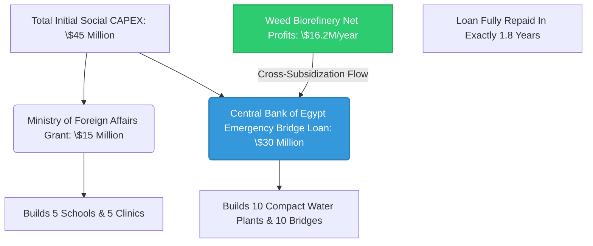

# 🌍 Project AQUA-ZEAL: Integrated Nile Basin Water & Agricultural Nexus 🚀

An end-to-end open-source strategic, geopolitical, technological, and financial master plan designed to secure **90 Billion Cubic Meters (BCM) of water annually** for the Arab Republic of Egypt, driving a massive sustainable agricultural revolution for strategic crops while fostering regional development across the Nile Basin (Egypt, Sudan, and South Sudan).

---

## 📜 Intellectual Property & Ownership Notice

This project, including all its architectural designs, financial feasibility studies, technical layouts, and implementation frameworks, is developed by and credited to:

* **Chief Engineer / Author:** AWSAN ADEL ABDULBARI AHMED SULTAN
* **National ID / Passport No:** 01010305468 (YEMEN)
* **Corporate Entity:** AWSAN DEW FOR MARKETING SERVICES
* **Contact Phone:** +967 777 852 433

> 📄 **LICENSE NOTICE:** Distributed under the **Creative Commons Attribution-NonCommercial-ShareAlike 4.0 International (CC BY-NC-SA 4.0)**. You are free to share and adapt this material for humanitarian, state-level, and non-commercial developmental purposes, provided appropriate credit is given to the author. Commercial utilization without express written permission is strictly prohibited.

---

## 🛠️ Project Core Sub-Systems & Architectural Framework

### 1. 🎛️ The Tripartite Digital Hydrological System
* **Concept:** Artificial Intelligence & IoT-driven real-time water data network connecting the Aswan High Dam (Egypt), Roseires Dam (Sudan), and the Grand Ethiopian Renaissance Dam - GERD (Ethiopia).
* **Mechanism:** Executing the **"Water-for-Energy Swap"** protocol, ensuring Ethiopia releases a minimum of **35 BCM/year** for hydro-generation, while Egypt purchases **4,000 MW/h** at a competitive price of **$0.035/kWh** for regional export (e.g., GREGY Project to Europe).

### 2. 🌲 Ethiopian Highlands Silt Mitigation & Agro-Forestry
* **Infrastructure:** Construction of **22 small check dams** capturing **45 Million m³ of silt annually** to prolong GERD’s operational life.
* **Agro-Expansion:** Planting **50 Million trees** across 120,000 acres to stabilize soil and offer Ethiopia localized, sustainable micro-irrigation options.

### 3. 🐊 Jonglei Canal Completion & Socio-Economic Development (Final 100 km)
* **Engineering:** Resuming the final 100 km stretch using advanced hydraulic cutters to pump **9 BCM/year** (Shared 50/50: 4.5 BCM to Egypt, 4.5 BCM to South Sudan).
* **Socio-Economic Shield:** Implementation of a **$45 Million parallel developmental package** over the 100 km line to win local tribal alliance:
  * **10 Compact Water Treatment Plants** (2,000 m³/day each, placed every 10 km).
  * **10 Engineered Livestock Crossings** to prevent community and herd isolation.
  * **5 Fully-equipped Primary Health Centers & 5 Schools.**

### 4. ⛽ Biorefineries & Weed Management (Bahr El Ghazal & Sobat Basins)
* **Harvesting:** Mechanical extraction of **120,000 Tons/year** of invasive water hyacinth and papyrus, saving **4 BCM/year** of water otherwise lost to evapotranspiration.
* **Biomass Upgrading:** Setting up two dual-processing Biorefineries in **Juba & Malakal**:
  * **Fast Pyrolysis (500°C):** Yields **24 Million Liters of Green Biodiesel annually** to fuel heavy machinery.
  * **Anaerobic Digestion:** Generates **30 Million m³ of Biomethane Gas/year**, producing **8 MW of baseline green electricity** for canal villages.
  * **Biochar Production:** **7,500 Tons/year** distributed as high-efficiency soil conditioners.

### 5. 🌊 The Great Circular Artificial River (Mediterranean Coast)
* **Hydraulics:** A 450 km lined artificial river running from Alexandria to Salloum, supplied by **4 massive solar-powered (CSP) desalination plants** producing **4 Million m³/day**.
* **Agricultural Yield:** Cultivation of **800,000 acres** of strategic crops. Annual yield directly covers domestic import gaps: **8.6% of Wheat gap** (1.08 Million Tons) and **10.6% of Yellow Corn gap** (960,000 Tons).

---

## 📈 Financial Matrix & Integration Blueprint

This ecosystem operates on a highly advanced **Parallel Financial Integration Framework** designed to minimize state-budget impacts. Below is the interactive flow chart demonstrating how weed biorefinery profits cross-subsidize the social development infrastructure:

### Quick Financial Summary:
* **Weed Project CAPEX:** **$35 Million** (Funded via Sovereign Wealth Funds & Green Bonds).
* **Weed Project Net Profit:** **$16.2 Million annually** from Biodiesel & Biogas sales.
* **Sovereign Cross-Subsidization:** The **$16.2M annual profit** pays off the Central Bank's $30M bridge loan in **exactly 1 year and 10 months**, rendering the entire socio-developmental package fully self-sustaining.

---

## ⚠️ Emergency Contingency & Mitigation Framework

### 1. Climate Shock: Severe Multi-Year Drought
* **Impact:** Inflow reduction in the Blue Nile below critical agricultural operational thresholds.
* **Mitigation:** Automated trigger of the Tripartite System to reduce GERD's storage rate; immediate 25% scale-up of Mediterranean SWRO desalination capacity via standby units; drawdown of ASR (Aquifer Storage and Recovery) reserves.
* **Budget Allocations:** **$150 Million Emergency Liquidity Buffer.**

### 2. Geopolitical Disturbances (Local Infrastructure Threats)
* **Impact:** Interruption of the final 100 km Jonglei canal dredging due to local tribal friction.
* **Mitigation:** Deploy the Joint Military Command (Egypt-South Sudan Force); transition dredging operations to autonomous/drone-monitored schedules; distribute immediate free purified water via the compact treatment units to de-escalate community stress.
* **Budget Allocations:** **$65 Million Security Logistics Buffer.**

### 3. Engineering Challenge: Sub-surface Aquifer Clogging
* **Impact:** Reduction in filtration capacity and injection borehole binding during winter ASR cycles.
* **Mitigation:** Mandate active dynamic Pre-treatment (Ultrafiltration) keeping TSS < 1mg/L; apply shock chlorination to disrupt bio-films; execute automated weekly 4-hour high-velocity backwashing cycles.
* **Budget Allocations:** **Absorbed into standard system OPEX.**

---

## 🚀 Tectonic Future Expansion Roadmap (Beyond 2026)

To fully scale the agricultural yields and maximize water abundance, the following expansion phases are programmed into the system design:

* **Phase I (Digital Twin Modeling):** Constructing a complete Hydro-Geospatial Digital Twin of the Nile Basin using satellite telemetry and Python ML pipelines to predict sub-Saharan precipitation patterns up to 6 months in advance.
* **Phase II (Sub-continental Grid Linking):** Extending the energy-water corridor down to the Democratic Republic of Congo (DRC) to assess the feasibility of the **Congo-Nile River Interconnection**, potentially injecting an additional 50-80 BCM into the system.
* **Phase III (Commercial Bio-Chemical Export):** Scaling up the Malakal and Juba biorefineries to produce pharmaceutical-grade organic compounds and bio-plastics from aquatic biomass for European export markets.

---
*Developed under the sovereign vision of Eng. Awsan Adel Abdulbari Ahmed Sultan © 2026. Dedicated to Nile Basin Sustainable Wealth & Prosperity.*
