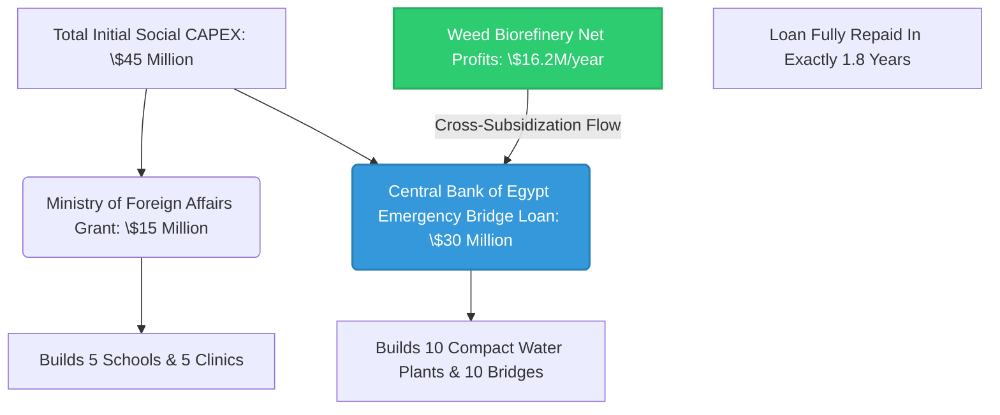
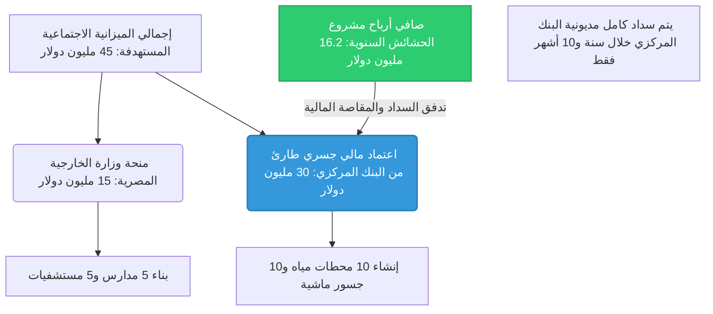

# 🌍 Project AQUA-ZEAL: Integrated Nile Basin Water & Agricultural Nexus 🚀

An end-to-end open-source strategic, geopolitical, technological, and financial master plan designed to secure **90 Billion Cubic Meters (BCM) of water annually** for the Arab Republic of Egypt, driving a massive sustainable agricultural revolution for strategic crops while fostering regional development across the Nile Basin (Egypt, Sudan, and South Sudan).

---

## 📜 Intellectual Property & Ownership Notice

This project, including all its architectural designs, financial feasibility studies, technical layouts, and implementation frameworks, is developed by and credited to:

* **Chief Engineer / Author:** AWSAN ADEL ABDULBARI AHMED SULTAN
* **National ID / Passport No:** 01010305468 (YEMEN)
* **Corporate Entity:** AWSAN DEW FOR MARKETING SERVICES
* **Contact Phone:** +967 777 852 433

> 📄 **LICENSE NOTICE:** Distributed under the **Creative Commons Attribution-NonCommercial-ShareAlike 4.0 International (CC BY-NC-SA 4.0)**. You are free to share and adapt this material for humanitarian, state-level, and non-commercial developmental purposes, provided appropriate credit is given to the author. Commercial utilization without express written permission is strictly prohibited.

---

## 🛠️ Project Core Sub-Systems & Architectural Framework

### 1. 🎛️ The Tripartite Digital Hydrological System
* **Concept:** Artificial Intelligence & IoT-driven real-time water data network connecting the Aswan High Dam (Egypt), Roseires Dam (Sudan), and the Grand Ethiopian Renaissance Dam - GERD (Ethiopia).
* **Mechanism:** Executing the **"Water-for-Energy Swap"** protocol, ensuring Ethiopia releases a minimum of **35 BCM/year** for hydro-generation, while Egypt purchases **4,000 MW/h** at a competitive price of **$0.035/kWh** for regional export (e.g., GREGY Project to Europe).

### 2. 🌲 Ethiopian Highlands Silt Mitigation & Agro-Forestry
* **Infrastructure:** Construction of **22 small check dams** capturing **45 Million m³ of silt annually** to prolong GERD’s operational life.
* **Agro-Expansion:** Planting **50 Million trees** across 120,000 acres to stabilize soil and offer Ethiopia localized, sustainable micro-irrigation options.

### 3. 🐊 Jonglei Canal Completion & Socio-Economic Development (Final 100 km)
* **Engineering:** Resuming the final 100 km stretch using advanced hydraulic cutters to pump **9 BCM/year** (Shared 50/50: 4.5 BCM to Egypt, 4.5 BCM to South Sudan).
* **Socio-Economic Shield:** Implementation of a **$45 Million parallel developmental package** over the 100 km line to win local tribal alliance:
  * **10 Compact Water Treatment Plants** (2,000 m³/day each, placed every 10 km).
  * **10 Engineered Livestock Crossings** to prevent community and herd isolation.
  * **5 Fully-equipped Primary Health Centers & 5 Schools.**

### 4. ⛽ Biorefineries & Weed Management (Bahr El Ghazal & Sobat Basins)
* **Harvesting:** Mechanical extraction of **120,000 Tons/year** of invasive water hyacinth and papyrus, saving **4 BCM/year** of water otherwise lost to evapotranspiration.
* **Biomass Upgrading:** Setting up two dual-processing Biorefineries in **Juba & Malakal**:
  * **Fast Pyrolysis (500°C):** Yields **24 Million Liters of Green Biodiesel annually** to fuel heavy machinery.
  * **Anaerobic Digestion:** Generates **30 Million m³ of Biomethane Gas/year**, producing **8 MW of baseline green electricity** for canal villages.
  * **Biochar Production:** **7,500 Tons/year** distributed as high-efficiency soil conditioners.

### 5. 🌊 The Great Circular Artificial River (Mediterranean Coast)
* **Hydraulics:** A 450 km lined artificial river running from Alexandria to Salloum, supplied by **4 massive solar-powered (CSP) desalination plants** producing **4 Million m³/day**.
* **Agricultural Yield:** Cultivation of **800,000 acres** of strategic crops. Annual yield directly covers domestic import gaps: **8.6% of Wheat gap** (1.08 Million Tons) and **10.6% of Yellow Corn gap** (960,000 Tons).

---

## 📈 Financial Matrix & Integration Blueprint

This ecosystem operates on a highly advanced **Parallel Financial Integration Framework** designed to minimize state-budget impacts. Below is the interactive flow chart demonstrating how weed biorefinery profits cross-subsidize the social development infrastructure:

### Quick Financial Summary:
* **Weed Project CAPEX:** **$35 Million** (Funded via Sovereign Wealth Funds & Green Bonds).
* **Weed Project Net Profit:** **$16.2 Million annually** from Biodiesel & Biogas sales.
* **Sovereign Cross-Subsidization:** The **$16.2M annual profit** pays off the Central Bank's $30M bridge loan in **exactly 1 year and 10 months**, rendering the entire socio-developmental package fully self-sustaining.

---

## ⚠️ Emergency Contingency & Mitigation Framework

### 1. Climate Shock: Severe Multi-Year Drought
* **Impact:** Inflow reduction in the Blue Nile below critical agricultural operational thresholds.
* **Mitigation:** Automated trigger of the Tripartite System to reduce GERD's storage rate; immediate 25% scale-up of Mediterranean SWRO desalination capacity via standby units; drawdown of ASR (Aquifer Storage and Recovery) reserves.
* **Budget Allocations:** **$150 Million Emergency Liquidity Buffer.**

### 2. Geopolitical Disturbances (Local Infrastructure Threats)
* **Impact:** Interruption of the final 100 km Jonglei canal dredging due to local tribal friction.
* **Mitigation:** Deploy the Joint Military Command (Egypt-South Sudan Force); transition dredging operations to autonomous/drone-monitored schedules; distribute immediate free purified water via the compact treatment units to de-escalate community stress.
* **Budget Allocations:** **$65 Million Security Logistics Buffer.**

### 3. Engineering Challenge: Sub-surface Aquifer Clogging
* **Impact:** Reduction in filtration capacity and injection borehole binding during winter ASR cycles.
* **Mitigation:** Mandate active dynamic Pre-treatment (Ultrafiltration) keeping TSS < 1mg/L; apply shock chlorination to disrupt bio-films; execute automated weekly 4-hour high-velocity backwashing cycles.
* **Budget Allocations:** **Absorbed into standard system OPEX.**

---

## 🚀 Tectonic Future Expansion Roadmap (Beyond 2026)

To fully scale the agricultural yields and maximize water abundance, the following expansion phases are programmed into the system design:

* **Phase I (Digital Twin Modeling):** Constructing a complete Hydro-Geospatial Digital Twin of the Nile Basin using satellite telemetry and Python ML pipelines to predict sub-Saharan precipitation patterns up to 6 months in advance.
* **Phase II (Sub-continental Grid Linking):** Extending the energy-water corridor down to the Democratic Republic of Congo (DRC) to assess the feasibility of the **Congo-Nile River Interconnection**, potentially injecting an additional 50-80 BCM into the system.
* **Phase III (Commercial Bio-Chemical Export):** Scaling up the Malakal and Juba biorefineries to produce pharmaceutical-grade organic compounds and bio-plastics from aquatic biomass for European export markets.

---
*Developed under the sovereign vision of Eng. Awsan Adel Abdulbari Ahmed Sultan © 2026. Dedicated to Nile Basin Sustainable Wealth & Prosperity.*

---

# 🌍 مشروع AQUA-ZEAL: المحور المائي والزراعي المتكامل لأمن حوض النيل الاستراتيجي 🚀

خطة هندسية، وجيوسياسية، وتكنولوجية، ومالية متكاملة (مفتوحة المصدر) تستهدف تأمين **90 مليار متر مكعب من المياه سنوياً** لجمهورية مصر العربية وحوض النيل، لقيادة ثورة زراعية مستدامة للمحاصيل الاستراتيجية مع تعزيز التنمية الإقليمية المشتركة (مصر، السودان، جنوب السودان).

---

## 📜 إشعار الملكية الفكرية وحقوق الابتكار

تم تطوير هذا المشروع بكافة تصاميمه الهندسية، ودراسات الجدوى المالية، والمخططات التقنية، وأطر التنفيذ، وهو منسوب بالكامل ومسجل باسم:

* **المهندس والمبتكر الرئيسي:** أوسان عادل عبدالباري أحمد سلطان (AWSAN ADEL ABDULBARI AHMED SULTAN)
* **رقم الهوية الوطنية / الجواز:** 01010305468 (الجمهورية اليمنية - YEMEN)
* **الكيان الاعتباري:** أوسان ديو لخدمات التسويق (AWSAN DEW FOR MARKETING SERVICES)
* **رقم الهاتف للتواصل:** 00967777852433 

> 📄 **إشعار الرخصة:** مُوزع بموجب رخصة **(CC BY-NC-SA 4.0) المشاع الإبداعي: نسب المصنف - غير تجاري - الترخيص بالمثل 4.0 دولي**. يُسمح بمشاركة هذا المحتوى وتطويره للأغراض الإنسانية، والتنموية على مستوى الدول، وغير التجارية، شريطة ذكر المبتكر الأصلي. يُحظر تماماً الاستغلال التجاري للمشروع دون إذن كتابي رسمي وموثق من صاحب الشأن.

---

## 🛠️ الأنظمة الفرعية ومكونات المشروع الهندسية

### 1. 🎛️ المنظومة الرقمية الثلاثية لإدارة التدفقات الهيدروليكية
* **المفهوم:** شبكة بيانات رقمية لحظية قائمة على الذكاء الاصطناعي وإنترنت الأشياء (IoT) لربط السد العالي (مصر)، سد الروصيرص (السودان)، وسد النهضة الإثيوبي.
* **الآلية:** تفعيل بروتوكول **"مقايضة المياه بالطاقة النظيفة"**، حيث تلتزم إثيوبيا بتصريف حد أدنى لا يقل عن **35 مليار متر مكعب سنوياً** من النيل الأزرق للتوليد الكهرمائي، وفي المقابل تشتري مصر **4,000 ميجاوات/ساعة** بسعر تفضيلي يبلغ **0.035 دولار لكل كيلوواط** لإعادة تصديرها إقليمياً (مثل مشروع الربط GREGY مع أوروبا).

### 2. 🌲 منظومة حجز الطمي والتشجير بالهضبة الإثيوبية
* **البنية التحتية:** بناء **22 سداً صغيراً لحصاد الطمي** (Check Dams) لحجز **45 مليون متر مكعب من الإطماء سنوياً** لإطالة العمر الافتراضي لسد النهضة.
* **التوسع الزراعي:** استزراع **50 مليون شجرة** على مساحة 120 ألف فدان لتثبيت التربة، ومنح إثيوبيا خيارات ري تكميلي محلي مستدام دون استهلاك مجرى النهر.

### 3. 🐊 استكمال قناة جونقلي والتنمية الاجتماعية (الـ 100 كم المتبقية)
* **الهندسة:** استئناف الشق الهيدروليكي للمسار المتبقي لضخ **9 مليارات متر مكعب سنوياً** تُقسم مناصفة (4.5 مليار م³ لمصر، و4.5 مليار م³ لجنوب السودان).
* **الحاضنة الشعبية:** تنفيذ **حزمة تنموية موازية بقيمة 45 مليون دولار** على طول خط الـ 100 كم لكسب ولاء القبائل المحلية وتأمين الآليات:
  * **10 محطات تنقية مياه شرب مدمجة** (بطاقة 2,000 م³/يوم لكل محطة، بواقع محطة كل 10 كم).
  * **10 جسور خرسانية ممرات عبور آمنة للماشية** لمنع عزل القرى عن مراعيها.
  * **5 مراكز رعاية صحية أولية متكاملة التجهيز و5 مدارس تعليم أساسي.**

### 4. ⛽ مصانع المعالجة الحيوية وتطهير الحشائش (بحر الغزال ونهر السوباط)
* **الحصاد الآلي:** إزالة **120,000 طن سنوياً** من الحشائش الطفيلية (ورد النيل والبردي)، مما يوفر **4 مليارات متر مكعب سنوياً** من المياه الضائعة بالبخر.
* **التحويل الحيوي:** إنشاء مجمعين للمعالجة الحيوية في **جوبا وملكال**:
  * **التحلل الحراري (Pyrolysis) عند 500° مئوية:** يُنتج **24 مليون لتر من الديزل الحيوي الأخضر سنوياً** لتشغيل المعدات وحفارات القناة.
  * **التخمير اللاهوائي:** يُنتج **30 مليون متر مكعب من غاز الميثان الحيوي سنوياً** لتوليد **8 ميجاوات من الكهرباء النظيفة المستمرة** لقرى القناة.
  * **الفحم الحيوي (Biochar):** إنتاج **7,500 طن سنوياً** كمخصب ومصلح تربة فائق الكفاءة.

### 5. 🌊 النهر الصناعي العظيم الدوار (الساحل الشمالي المصري)
* **الهيدروليكا:** مجرى مائي مبطن ومكشوف بطول 450 كم يمتد من غرب الإسكندرية إلى السلوم، يتغذى عبر **4 محطات تحلية عملاقة** تعمل بالطاقة الشمسية المركزة (CSP) بطاقة **4 ملايين متر مكعب يومياً**.
* **الإنتاج الزراعي:** استصلاح وزراعة **800,000 فدان** بالمحاصيل الاستراتيجية. يغطي الإنتاج السنوي مباشرة فجوة الاستيراد المصرية: **8.6% من فجوة القمح** (1.08 مليون طن) و**10.6% من فجوة الذرة الصفراء** (960 ألف طن).

---

## 📈 المصفوفة المالية والتدفق التكاملي

تدار هذه المنظومة وفق **"نموذج التمويل الجسري والتبادلي الموازي"** لرفع الأعباء الفورية عن موازنة الدولة؛ حيث تمثل اللوحة التخطيطية أدناه تدفق التمويل والمقاصة الذاتية من أرباح مشروع الحشائش:

### ملخص مالي سريع:
* **التكلفة الرأسمالية لمشروع الحشائش (CAPEX):** **35 مليون دولار** (بتمويل مشترك من الصناديق السيادية والسندات الخضراء الدولية).
* **صافي الربح السنوي للمشروع:** **16.2 مليون دولار** ناتجة من مبيعات الديزل والغاز الحيوي.
* **الاسترداد الذاتي المستدام:** أرباح مشروع الحشائش تسدد الـ 30 مليون دولار الخاصة بالبنك المركزي في غضون **سنة و10 أشهر فقط**، ليصبح المشروع التنموي بأكمله مغطى وممولاً ذاتياً بالكامل.

---

## ⚠️ خطة الطوارئ والمحاور الستية لإدارة الأزمات

### 1. الصدمات المناخية: سنوات الجفاف الممتد في الهضبة الإثيوبية
* **الأثر:** تراجع تدفقات النيل الأزرق دون الحدود التشغيلية المعتادة.
* **إجراءات الطوارئ:** تفعيل بروتوكول الذكاء الاصطناعي لتقليل معدل حجز المياه في سد النهضة؛ رفع كفاءة محطات تحلية الساحل الشمالي بنسبة 25% عبر تشغيل وحدات الدعم المتنقلة؛ وسحب المياه الاحتياطية الآمنة من منظومة شحن الخزانات الجوفية (ASR).
* **الميزانية المرصودة:** **150 مليون دولار كاحتياطي سيولة طارئ.**

### 2. الاضطرابات الجيوسياسية والأمنية (تهديدات مواقع العمل الإقليمية)
* **الأثر:** تعطل أعمال الحفر والتكرير في خط الـ 100 كم بجنوب السودان نتيجة احتكاكات قبلية.
* **إجراءات الطوارئ:** تحريك قوة التأمين العسكري المشتركة؛ الانتقال بالكامل لأنظمة الحفر والتطهير المبرمجة آلياً والمراقبة بطائرات الدرون الحرارية؛ وتوجيه محطات المياه المدمجة لضخ المياه النقية مجاناً للقبائل كأداة لاحتواء التوتر ميدانياً.
* **الميزانية المرصودة:** **65 مليون دولار لوجستيات وتأمين أنظمة المراقبة.**

### 3. التحديات الهندسية: انسداد مسام الخزانات الباطنية في وحدات الحقن (ASR)
* **الأثر:** ترسب المواد العالقة ونمو الأغشية البكتيرية المخاطية في آبار حقن المياه الشتوية.
* **إجراءات الطوارئ:** إلزامية الترشيح الديناميكي الفائق (Ultrafiltration) لضمان بقاء العوالق TSS < 1 ملجم/لتر؛ الضخ الدوري لجرعات الكلور الصدمية لقتل البكتيريا؛ والتشغيل التلقائي العكسي (Backwashing) لمدة 4 ساعات أسبوعياً لتطهير مسام خزان الحجر الرملي النوبي.
* **الميزانية المرصودة:** **مدمجة ومستوعبة بالكامل ضمن المصاريف التشغيلية للمشروع (OPEX).**

---

## 🚀 الخارطة التوسعية والمستقبلية للمنظومة (رؤية ما بعد 2026)

لضمان مواكبة النمو السكاني ورفع فائض الأمن الغذائي والمائي، تم دمج محاور التوسع القادمة في التصميم الهيكلي للمشروع:

* **المرحلة الأولى (التوأم الرقمي):** بناء نموذج محاكاة وتوأم رقمي (Digital Twin) كامل لحوض النيل بالاعتماد على خوارزميات التعلم الآلي ولغة Python للتنبؤ الدقيق بحجم الأمطار السنوية في منابع النيل قبل حدوثها بـ 6 أشهر.
* **المرحلة الثانية (الربط المائي العابر للقارة):** بدء الدراسات اللوجستية والفنية لإمكانية ربط نهر الكونغو بنهر النيل (Congo-Nile Interconnection)، لضخ كميات ضخمة إضافية تتراوح بين 50 إلى 80 مليار متر مكعب سنوياً في المجرى الرئيسي.
* **المرحلة الثالثة (التصدير الكيميائي الحيوي):** توسيع مصانع جوبا وملكال لتشمل خطوط إنتاج متطورة لاستخراج البلاستيك الحيوي (Bioplastics) والمركبات العضوية عالية النقاء من الحشائش النهرية لتصديرها للأسواق الأوروبية كمنتجات خضراء صديقة للبيئة.

---
*تم إعداد وتصميم هذه الرؤية السيادية بواسطة المهندس أوسان عادل عبدالباري أحمد سلطان © 2026. تكنولوجيا استراتيجية ومحمية لصالح نماء وازدهار شعوب وادي النيل.*

