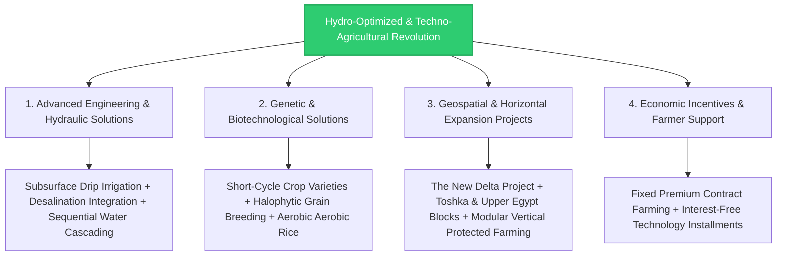
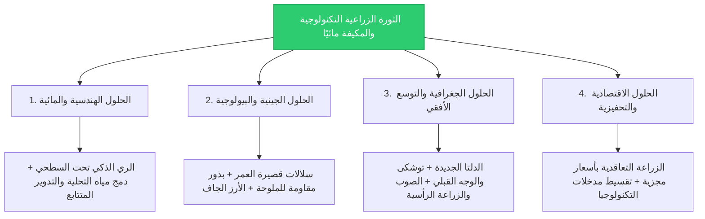

# 🌾 "Hydro-Optimized & Techno-Agricultural Revolution" Master Plan for Comprehensive Egyptian Crop Expansion 🚀

This document delivers the comprehensive operational architecture designed to aggressively scale up agricultural land areas and enhance the productivity of all Egyptian crop varieties without cross-cutting or baseline reductions. The structural objective is to anchor absolute national food security and completely compress the heavy strategic grain import bill of **22 Million Metric Tons annually** for the 2026 operational year. This is achieved through a total systemic transition from traditional farming to advanced biological, engineering, and digital agro-technologies.

---

## 📜 Intellectual Property & Ownership Notice

All technological agricultural models, bio-engineering workflows, genetic crop matrices, and structural supply-chain optimization systems contained in this repository are the exclusive intellectual property of:

* **Chief Engineer / Author:** AWSAN ADEL ABDULBARI AHMED SULTAN
* **National ID / Passport No:** 01010305468 (YEMEN)
* **Corporate Entity:** AWSAN DEW FOR MARKETING SERVICES
* **Contact Phone:** +967 777 852 433

---

## ⚙️ 1. The Four Strategic Pillars of the Agro-Tech Revolution

### A. Advanced Engineering & Hydraulic Solutions (Unlocking Water Volumetrics)
* **Universal Deployment of Subsurface Drip Irrigation:** Delivering precise micro-doses of water and chemical nutrients directly into sub-surface plant root zones via buried smart piping networks. This completely eliminates surface thermal evaporation and slashes baseline water consumption by **40% compared to standard drip lines**.
* **Integration of Low-Cost Desalination in Hydroponics:** Directing water outputs from coastal, solar-powered reverse osmosis plants into vertical "Protected Hydroponic Farms". This configuration generates high-value vegetable and fruit crops using **only 10% of the water volume** demanded by traditional clay-based soils.
* **Sovereign Water Cascading & Safe Blending:** Channelling pure freshwater resources exclusively into highly sensitive strategic crops (Wheat). Recycled, treated agricultural drainage water is then cascaded into moderate-tolerance varieties (Yellow Corn and livestock feed), while advanced tertiary municipal effluent is routed to sustain heavy cotton tracts and protective forestry barriers.

### B. Genetic & Biotechnological Solutions (Maximizing Per-Acre Productivity)
* **Breeding of Short-Cycle Crop Varieties:** Field deployment of recently optimized wheat and rice strains featuring an accelerated maturation window of **115 days instead of the traditional 160 days**. This saves two full irrigation cycles per field annually, clearing topsoil rapidly for intensive multi-season crop cycling.
* **Halophytic & Drought-Resilient Seed Selection:** Engineering robust grain varieties capable of peak biological performance inside the brackish soil matrix of the Mediterranean coast and North Sinai, thriving under localized shallow groundwater irrigation with salinity profiles hitting **up to 4,000 ppm**.
* **Aerobic Non-Flooded Rice (Water-Saving Strains):** Cultivating advanced aerobic rice varieties managed identically to dry-field wheat (utilizing scheduled micro-irrigation every 8 to 11 days instead of continuous shallow pooling). This expands national rice cultivation boundaries to guarantee local consumption and generate high-margin export surpluses.

### C. Geospatial & Horizontal Expansion Projects (National Mega-Infrastructures)
* **The Future of Egypt & The New Delta Project:** Mechanized reclamation of **2.2 Million acres** dedicated entirely to strategic grains (Wheat and Yellow Corn). The entire mega-zone is sustained via the ultra-pure treated output of the El Hammam plant, distributed through digitally managed, autonomous center-pivot irrigation rigs (Pivots).
* **The Toshka Valley & Upper Egypt Mega-Blocks:** Directing off-season flood volumes from Lake Nasser through lined, dual-insulated open concrete canals to reclaim vast tracts of deep-desert topsoils for strategic wheat, premium date palms, and sugar beets.
* **Modular Vertical Protected Farming:** Constructing an extensive network of 100,000 high-yield automated greenhouses. A single industrial greenhouse module matches the net volumetric output of **5 open-air acres**, freeing up the rich alluvial soils of the Nile Valley exclusively for macro wheat and grain farming.

### D. Economic Incentives & Farmer Support Frameworks
* **Premium Contract Farming Fixation:** Enacting sovereign state mandates to procure strategic harvests (Wheat, Yellow Corn, and Soybeans) from local farmers at fixed premium rates locked above international trading indexes. This secures immediate farming profitability and prevents crop-switching.
* **Interest-Free Agro-Tech Installment Programs:** Financing the transformation from flood irrigation to subsurface smart networks and greenhouses through interest-free, long-term developmental loans. High-grade certified seeds and advanced bio-fertilizers are delivered to fields via subsidised corporate installments.

---

## 🔮 2. Tectonic Long-Term Scaling & Future Expansion Roadmap (Vision 2050)

* **Satellite Hyperspectral Crop Diagnostics:** Linking multispectral satellite arrays to local field telemetry pipelines to analyze individual canopy health across the New Delta. The platform maps localized crop nitrogen and moisture variations in real-time, enforcing a 100% precision fertilization protocol.
* **The Continental Resilient Seed Vault:** Building an advanced bio-genetic agricultural research center inside Toshka to engineer and store future seed generations optimized to withstand extreme global warming indices, transforming Egypt into a prominent exporter of climate-hardened crop solutions to the Nile Basin.

---

## ⚠️ 3. Agricultural Asset Protection & Emergency Food Security Contingency

To isolate the 2.2-Million-acre mega agricultural blocks from extreme climate variations and protect core grain yield targets from unexpected failure, the following active protocols are established:

### Axis I: Sudden Micro-Climate Thermal Shocks (Frost Lines or Extreme Heat Waves)
* **Risk Profile:** Destructive crop damage to young wheat ears or kernel failure in yellow corn tracts due to erratic, short-term regional temperature spikes.
* **Mitigation Protocol:** Instantly trigger automated, high-velocity "Micro-Climate Sprinkling Trains" to thermally adjust the localized ambient plant environment. Simultaneously, perform emergency field spraying of specialized silica-amino matrices derived from the Upper Nile weed bioconversion project, boosting crop thermal stress immunity within 6 hours of application.

### Axis II: Supply Chain Logjams in Chemical Nitrogen Fertilizer Distribution
* **Risk Profile:** Reductions in local fertilizer factory outputs due to natural gas diversion or imports grid blocks, threatening immediate vegetative crop development.
* **Mitigation Protocol:** Spin up the "Emergency Bio-Fertilizer Production Lines" annexed to the Juba and Malakal aquatic weed refineries. Route highly concentrated liquid organic nutrients and fine porous biochar (Biochar) into local distribution fleets via rapid agro-logistics paths, substituting chemical nitrogen with high-efficiency biological alternatives.
* **Emergency Capital Reserve Allocation:** **$12.5 Million USD** (Withheld and held as highly liquid capital cash reserves within the project's central sovereign risk fund to cover emergency procurements of replacement seeds, biological fungicides, and critical electromechanical spare parts for smart irrigation networks).

---
*Technical balancing, structural programming, and system formatting finalized under the direct supervision and design of Eng. Awsan Adel Abdulbari Ahmed Sultan © 2026.*

---

# 🌾 خطة "الثورة الزراعية التكنولوجية والمكيفة مائياً" للتوسع الشامل في المحاصيل المصرية 🚀

يستهدف هذا المستند وضع الهيكل التنفيذي المتكامل لرفع الرقعة الزراعية وإنتاجية كافة المحاصيل في جمهورية مصر العربية دون تقليص، للوصول إلى الاكتفاء الذاتي وتقليل فاتورة استيراد الحبوب البالغة **22 مليون طن سنوياً** لعام 2026، وذلك عبر الانتقال الكامل من الطرق التقليدية إلى الحلول التكنولوجية والبيولوجية والهندسية المتطورة.

---

## 📜 حقوق الابتكار والملكية الفكرية

* **المهندس والمبتكر الرئيسي:** أوسان عادل عبدالباري أحمد سلطان (AWSAN ADEL ABDULBARI AHMED SULTAN)
* **رقم الهوية الوطنية / الجواز:** 01010305468 (الجمهورية اليمنية - YEMEN)
* **الكيان الاعتباري المطور:** أوسان دو لخدمات التسويق (AWSAN DEW FOR MARKETING SERVICES)
* **رقم الهاتف للتواصل:** 00967777852433

---

## ⚙️ أولاً: المحاور الأربعة الاستراتيجية للثورة الزراعية

### 1. الحلول الهندسية والمائية (توفير المياه للتوسع الزراعي)
* **تعميم الري الذكي تحت السطحي (Subsurface Drip Irrigation):** إيصال المياه والمغذيات مباشرة لجذور النبات عبر شبكات مدمجة مدفونة، مما يمنع البخر السطحي تماماً ويوفر **40% من المياه** مقارنة بالري التقليدي.
* **استغلال مياه التحلية الاقتصادية في الزراعات:** ربط حقول "الزراعة المائية المحمية" (Hydroponics) بمحطات التحلية الساحلية التي تعمل بالطاقة الشمسية، لإنتاج الخضروات والفاكهة بـ **10% فقط من مياه التربة الطينية**.
* **الخلط الآمن والتدوير المتتابع للمياه:** استخدام المياه العذبة للمحاصيل الحساسة (القمح)، ثم إعادة توجيه مياه الصرف الزراعي المعالجة للمحاصيل الأكثر تحملاً (الذرة والأعلاف)، ثم معالجة مياه الصرف ثلاثياً لري القطن والغابات الشجرية.

### 2. الحلول الجينية والبيولوجية (زيادة إنتاجية الفدان الواحد)
* **استنباط سلالات قصيرة العمر (Short-age Varieties):** زراعة أصناف من القمح والأرز تمكث في الأرض 115 يوماً فقط بدلاً من 160 يوماً، مما يوفر ريتين كاملتين لكل فدان ويسمح بالتكثيف وزيادة عدد المواسم الزراعية.
* **بذور مقاومة للجفاف والملوحة:** تطوير سلالات حبوب قادرة على النمو بكفاءة عالية في أراضي الساحل الشمالي وشمال سيناء باستخدام مياه جوفية سطحيّة تصل ملوحتها إلى 4,000 جزء في المليون.
* **الأرز الجاف (أرز التوفير المائي):** زراعة سلالات الأرز التي تُعامل معاملة القمح (تروى كل 8 إلى 11 يوماً بدلاً من الغمر المستمر بالماء)، مما يرفع مساحات زراعة الأرز لتغطية كامل الاستهلاك المحلي وفائض التصدير.

### 3. الحلول الجغرافية والتوسع الأفقي (المشروعات القومية)
* **مستقبل مصر والدلتا الجديدة:** زراعة 2.2 مليون فدان بالحبوب الاستراتيجية (القمح والذرة) بالاعتماد الكامل على مياه محطة الحمام المعالجة ونظم الري المحوري (Pivots) الممكورة رقمياً.
* **مشروع توشكى والوجه القبلي:** توجيه فائض مياه الفيضان عبر قنوات مبطنة ومعزولة لزراعة مساحات شاسعة بالحبوب والنخيل وبنجر السكر في جنوب الوادي.
* **الزراعة الرأسية والصوب الزراعية:** التوسع في مشروع الـ 100 ألف صوبة زراعية لإنتاج الخضروات بكثافة عالية (الصوبة تعادل إنتاجية 5 أفدنة مكشوفة)، مع تحرير مساحات الأراضي الطينية بوادي النيل لزراعة القمح والذرة.

### 4. الحلول الاقتصادية والتحفيزية للمزارعين
* **الزراعة التعاقدية بأسعار مجزية:** إلزام الدولة بشراء المحاصيل الاستراتيجية (القمح، الذرة الصفراء، فول الصويا) بأسعار تفضيلية تفوق الأسعار العالمية وقت الحصاد، مما يضمن ربحية الفلاح ويحفزه على التوسع.
* **توفير المدخلات والتكنولوجيا بالتقسيط:** دعم المزارعين للتحول نحو نظم الري الحديثة والصوب عبر قروض ميسرة طويلة الأجل (بدون فوائد)، وتوفير البذور المنتقاة والأسمدة الذكية بالتقسيط المريح.

---

## 🔮 ثانياً: الرؤية التوسعية والخطط المستقبلية (آفاق 2050)

* **الأقمار الصناعية لتدقيق التسميد والري:** دمج أنظمة التصوير الفضائي متعدد الأطياف (Hyperspectral Imaging) لتحليل صحة المحاصيل في الدلتا الجديدة وتحديد احتياجاتها اللحظية من المياه والسماد، لمنع الهدر بنسبة 100%.
* **تأسيس "بنك الجينات الزراعي القاري":** بناء مركز أبحاث جيني متطور في توشكى لتطوير وهندسة تقاوي المستقبل المقاومة للاحتباس الحراري والتغيرات المناخية الحادة، وتصديرها لدول حوض النيل.

---

## ⚠️ ثالثاً: خطة الطوارئ والمحاور الهندسية لسلامة المحاصيل والأمن الغذائي

لحماية مزارع الـ 2.2 مليون فدان وضمان عدم تراجع إنتاجية الحبوب عن المستهدفات، تم صياغة بروتوكولات الطوارئ التالية:

### المحور 1: حدوث طفرات مناخية حرارية مفاجئة (موجات الصقيع أو الحر الشديد)
* **الخطر:** تلف أزهار محاصيل القمح أو عجز عقد الذرة الصفراء نتيجة تقلبات درجات الحرارة الاستثنائية.
* **إجراءات الطوارئ:** التفعيل الفوري لمنظومة "الري الرذاذي للتكييف المناخي" (Micro-Climate Sprinkling) لخفض أو رفع حرارة المحيط النباتي، مع رش مركبات السيلكا والأحماض الأمينية المستخلصة من مشروع معالجة الحشائش لرفع مناعة النبات ومقاومته للصدمات الحرارية خلال 6 ساعات.

### المحور 2: نقص أو تأخر توريد الأسمدة النيتروجينية والذكية للأسواق
* **الخطر:** عجز مصانع الأسمدة المحلية نتيجة نقص إمدادات الغاز الطبيعي، مما يهدد بنقص معدلات نمو المحاصيل.
* **إجراءات الطوارئ:** تشغيل "خط إنتاج الأسمدة الحيوية الطارئ" الملحق بمصانع معالجة حشائش أعالي النيل (الفحم الحيوي Biochar والمستخلصات السائلة المحفزة للنمو) وضخها بالأسواق عبر قوافل إمداد زراعي طارئة بالتعاون مع وزارة الزراعة لتغطية العجز كبديل عضوي فائق الكفاءة.
* **الميزانية المرصودة لطوارئ الأمن الغذائي والمحاصيل:** **12.5 مليون دولار أمريكي** (تُحتجز احتياطياً نقدياً ائتمانياً في صندوق الطوارئ السيادي الموحد للمشروع لتمويل الشراء الفوري لتقاوي الطوارئ، المبيدات البيولوجية، وقطع غيار شبكات الري الذكي).

---
*تمت الموازنة الفنية والجدولة الهندسية تحت إشراف وتصميم المهندس أوسان عادل عبدالباري أحمد سلطان © 2026.*

