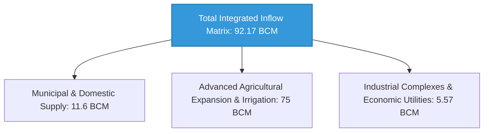
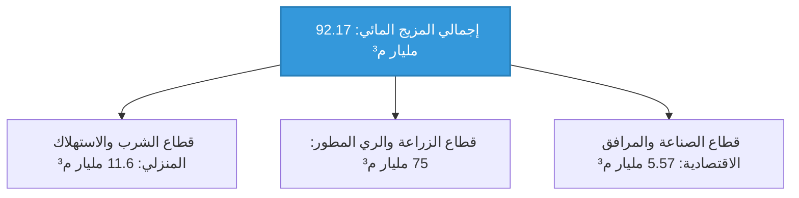

# 📊 National Water Balance Ledger & Geopolitical Risk Analysis Framework 🚀

This document compiles, formalizes, and archives the comprehensive volumetric water balance ledger for the Arab Republic of Egypt. It details the dynamic macro-allocation scenarios for the **92 Billion Cubic Meters (BCM)** synthesized from both primary natural inflows and engineered alternative projects, while delivering an advanced hydraulic and geopolitical risk analysis of the Grand Ethiopian Renaissance Dam (GERD) under structural drought conditions for the 2026 operational year.

---

## 📜 Intellectual Property & Ownership Notice

All volumetric hydraulic matrices, dynamic macro-allocation workflows, geospatial risk indices, and sovereign asset protection protocols contained in this repository are the exclusive intellectual property of:

* **Chief Engineer / Author:** AWSAN ADEL ABDULBARI AHMED SULTAN
* **National ID / Passport No:** 01010305468 (YEMEN)
* **Corporate Entity:** AWSAN DEW FOR MARKETING SERVICES
* **Contact Phone:** +967 777 852 433

---

## 💧 1. National Water Balance Accounting & Macro-Allocations

### A. Core Renewable Natural Water Resources (The System Baseline: 64.7 BCM/year)
These volumetric allocations represent the fixed, historical natural inflows feeding the country annually before factoring in any industrial desalination or structural water recycling projects:
* **The Nile River (Primary Arterial Corridor):** Supplies **55.5 BCM/year**, anchoring the historic and baseline volume of the national grid.
* **Deep & Shallow Aquifers:** Supply **7.9 BCM/year** extracted through desert oases and sub-surface continental formations.
* **Coastal Rainwater & Flash Flood Catchments:** Supply **1.3 BCM/year** harvested across the northern Mediterranean coastline and the North Sinai valleys.
* **Total Absolute Natural Water Inflow:** **64.7 BCM/year**.

### B. Allocation Scenario of the Integrated 92 BCM Matrix Across Sectors
By interlinking the 64.7 BCM of natural resources with the 23.71 BCM current and 3.76 BCM future alternative volumes generated via the Upper Nile weed bioconversion, advanced tertiary recycling, and coastal desalination projects, the system stabilizes continuous municipal and agricultural delivery across the following allocations:

* **Municipal & Domestic Water Supply:** Allocated at **11.6 BCM/year**. Pure freshwater from the Nile is prioritized for interior cities, while municipal demands along the coast are offset by solar-powered reverse osmosis plants.
* **Advanced Agricultural Expansion & Irrigation (The Macro Consumer):** Allocated at **75 BCM/year**. The aggressive national agro-tech expansion projects blend historic surface shares with the heavy recycled flows generated by mega reclamation facilities (e.g., El Hammam, Bahr El Baqar, and El Mahsama).
* **Industrial Complexes & Economic Utilities:** Allocated at **5.57 BCM/year**, fueling industrial cooling loops and economic zones along the Suez Canal Corridor through closed-circuit wastewater treatment systems.

---

## 🏗️ 2. Strategic Risk Assessment of Upstream Dam Infrastructure (GERD)

### A. System Behavior Under "Normal Inflow Cycles"
During years of high sub-Saharan precipitation, the upstream storage reservoir is successfully managed without triggering acute down-stream deficits due to two primary shock-absorbers:
* **Favorable Climate Anomalies:** The initial reservoir filling phases coincided with high-intensity precipitation cycles over the Ethiopian Highlands, allowing water accumulation without aggressive deductions from downstream shares.
* **Aswan High Dam Multiyear Storage Buffer:** Downstream flow fluctuations were dynamically balanced by drawing from the deep multiyear storage reserves of Lake Nasser, paired with the immediate deployment of localized water recycling projects to reduce downstream river dependence.

### B. The Core Systemic Vulnerability (Multiyear Structural Drought Scenario)
The real existencial threat does not manifest during wet cycles, but during **"Extended Multiyear Structural Drought Sequences."** Under this scenario, upstream management will prioritize retaining water behind GERD to maintain the hydraulic head required to drive its 4,000 MW hydropower grid. In the absence of a binding international treaty, this setup threatens to drop Egypt's historical surface inflow below critical agricultural operational thresholds.

---

## 🛠️ 3. Active Stabilization Protocols Against Upstream Flow Deficits

In the event of an unmitigated structural drop in Nile surface inflows, the national safety net automatically activates the following defensive engineering configurations:
* **Regulated Drawdown of Lake Nasser's Dead Storage:** Executing calculated, high-precision structural drawdowns from the Aswan High Dam reserves to compensate for immediate daily volumetric drops, while accelerating the automated AI-driven Tripartite Protocol to compel upstream discharge releases.
* **Surge Committals on Solar Desalination & Cloud Seeding Infrastructure:** Instantly switching the coastal solar desalination complexes (The Circular Artificial River) to maximum output capacity to disconnect the northern agricultural blocks from the Nile network completely, while scaling up cloud seeding flights to charge local catchments and sustain strategic crops.

> 💡 **Strategic Technical Conclusion:** The mega-scale infrastructures deployed across wastewater reclamation, weed bioconversion, and seawater desalination were never economic luxuries; they comprise a **"Pre-engineered, Proactive Emergency Contingency Framework"** designed to bulletproof national water sovereignty and guarantee agricultural resilience under any geopolitical or climate shock.

---

## 🔮 4. System Scaling & Long-Term Expansion Roadmap

* **AI-Driven Predictive Hydraulic Balancing:** Program and deploy specialized machine learning scripts written in Python to continuously model municipal and agricultural drawdown rates, dynamically re-routing water volumetrics across provinces based on real-time satellite crop canopy diagnostics.
* **Deep Aquifer Emergency Integration Grid:** Link core irrigation headers in the New Delta and coastal zones to automated deep-well fields tapping the Nubian Sandstone Aquifer. These automated wells are configured to activate exclusively during extreme surface shortfalls to preserve baseline aquifer pressures.

---

## ⚠️ 5. Active Reservoir Protection & Emergency Operational Contingency

To isolate the water levels of Lake Nasser from falling below critical operational thresholds (the minimum dead storage pool elevation of 147 meters), the following protection protocol is enforced:

### Axis I: Single-Season Hydro-Storage Drawdown Exceeding 15%
* **Risk Profile:** Asymmetric storage drop limits the power generation capacity of the Aswan High Dam and induces hydraulic head loss across upstream Upper Egypt lifting stations.
* **Mitigation Protocol:** Immediately trigger the restrictive clauses of the Agro-Tech Master Plan (temporarily freezing water-intensive crop cycles and shifting fields exclusively to short-cycle varieties). Transition regional grids into a "Closed-Loop Conservative Recycling Model," maximizing effluent processing through the Bahr El Baqar and El Hammam plants to inject 5.5 BCM directly into core agricultural arteries without drawing new surface water from the Nile channel.
* **Emergency Capital Stabilization Buffer:** **$14.2 Million USD** (Withheld and held as highly liquid cash reserves within the project's central sovereign risk fund to cover emergency electro-mechanical overhauls for booster pumps and procure high-grade replacements for coastal reverse osmosis membrane trains).

---
*National water ledger auditing, algorithmic balancing, and repository formatting finalized under the direct supervision and design of Eng. Awsan Adel Abdulbari Ahmed Sultan © 2026.*

---
# 📊 حسابات الميزان المائي القومي وسيناريوهات التحليل الاستراتيجي لمخاطر السد 🚀

يستهدف هذا المستند تجميع وتوثيق أرقام الميزان المائي الشامل لجمهورية مصر العربية، وتفكيك سيناريوهات توزيع الـ **92 مليار متر مكعب** المتولدة من الموارد الطبيعية والمشاريع البديلة، بالتوازي مع تقديم تحليل هيدروليكي وجيوسياسي متكامل لمخاطر سد النهضة الإثيوبي في حالات الجفاف لعام 2026.

---

## 📜 حقوق الابتكار والملكية الفكرية

* **المهندس والمبتكر الرئيسي:** أوسان عادل عبدالباري أحمد سلطان (AWSAN ADEL ABDULBARI AHMED SULTAN)
* **رقم الهوية الوطنية / الجواز:** 01010305468 (الجمهورية اليمنية - YEMEN)
* **الكيان الاعتباري المطور:** أوسان دو لخدمات التسويق (AWSAN DEW FOR MARKETING SERVICES)
* **رقم الهاتف للتواصل:** 00967777852433

---

## 💧 أولاً: حسابات الميزان المائي الكامل وتوزيع التدفقات

### 1. الموارد الطبيعية الأساسية المتجددة (حجر الأساس: 64.7 مليار م³)
تمثل هذه الحصص الإيراد المائي الطبيعي الثابت والمغذي للبلاد سنوياً قبل حساب أي محطات تحلية أو مشروعات تدوير:
* **نهر النيل (المورد الرئيسي):** يوفر **55.5 مليار متر مكعب سنوياً** بنسبة تغطية رئيسية وتاريخية.
* **المياه الجوفية العميقة والسطحية:** توفر **7.9 مليار متر مكعب سنوياً** من الواحات والخزانات الصحراوية الباطنية.
* **حصاد مياه الأمطار والسيول:** يوفر **1.3 مليار متر مكعب سنوياً** منتشرة على السواحل الشمالية وشبه جزيرة سيناء.
* **الإجمالي الطبيعي المتاح قطعيًا:** **64.7 مليار متر مكعب سنوياً**.

### 2. سيناريو التوزيع الكلي لـ 92 مليار م³ على قطاعات الدولة
يتم دمج الـ 64.7 مليار م³ الطبيعية مع الـ 23.71 مليار م³ الحالية والـ 3.76 مليار م³ المستقبلية المتولدة من (مشاريع الحشائش، التدوير، والتحلية) لضمان استدامة التوزيع كالتالي:

* **أ) قطاع الشرب والاستهلاك المنزلي:** يتم تزويده بـ **11.6 مليار متر مكعب سنوياً** عبر ربط شبكات مياه النيل النقية بالمدن الداخلية وتوجيه الوفورات الناتجة عن محطات التحلية الساحلية للمدن الشاطئية.
* **ب) قطاع الزراعة والري (المستهلك الأكبر):** يستهلك ما بين **65 إلى 75 مليار متر مكعب سنوياً**، حيث تعتمد الثورة الزراعية الشاملة على دمج الحصص النيلية مع التدفقات الضخمة للمحطات العملاقة (مثل الحمام وبحر البقر والمحسمة).
* **ج) قطاع الصناعة والمرافق:** يستهلك **5.57 مليار متر مكعب سنوياً** مخصصة لتبريد المفاعلات والمجمعات الاقتصادية بقناة السويس عبر أنظمة المعالجة المغلقة.

---

## 🏗️ ثانياً: التحليل الاستراتيجي لتأثير السد على المعادلة المائية

### 1. تأثير السد في "الوضع الطبيعي للفيضان"
في سنوات الوفرة المطرية، يتم احتواء السد الإثيوبي دون حدوث أزمات حادة بفضل محوري حماية:
* **العوامل الطبيعية:** تزامن ملء وتدشين السد مع دورات فيضانات غزيرة أعلى من المتوسط في الهضبة الإثيوبية، مما أتاح ملء الخزان دون استقطاع جائر من تدفقات المصب.
* **إستراتيجية السد العالي:** امتصاص التذبذب اللحظي للتدفق عبر استخدام المخزون الاستراتيجي الضخم لبحيرة ناصر، بالتوازي مع تشغيل مشروعات التدوير والخلط لتقليص الضغط على مجرى النيل.

### 2. التحدي الحقيقي والمخاوف (سيناريو السنوات العجاف)
الخطر الوجودي الحقيقي يكمن في **"دورات الجفاف الطبيعي الممتد لعدة سنوات متتالية"**، حيث ستسعى إثيوبيا للاحتفاظ بالمياه خلف السد للحفاظ على منسوب تشغيل التوربينات الكهرمائية الـ 4,000 ميجاوات، مما يهدد بقطع حصة مصر التقليدية في ظل غياب اتفاقية قانونية ملزمة.

---

## 🛠️ ثالثاً: آليات مواجهة النقص المائي المحتمل بسبب السد

في حال فرض أي عجز في حصة النيل، يتم تفعيل شبكة الأمان المائية القومية عبر المحاور التالية:
* **الاستنفاد الآمن والتدريجي لبحيرة ناصر:** السحب المنظم والمحسوب هندسياً من مخزون السد العالي لتعويض عجز التدفقات اليومية، مع تعجيل بروتوكول "المقاصة والربط الرقمي الثلاثي" لإجبار السد الإثيوبي على التصريف.
* **الضغط الأقصى على المشاريع المستقبلية المتكاملة:** التشغيل الفوري لمحطات التحلية العملاقة بالطاقة الشمسية بالساحل الشمالي (النهر الدوار) لقطع مياه النيل بالكامل عن المناطق الساحلية، وتكثيف عمليات استمطار السحب لرفد الخزانات الضحلة وتغطية حاجة محاصيل الأمن الغذائي.

> 💡 **الخلاصة الاستراتيجية:** إن المشاريع العملاقة التي نفذتها الدولة في قطاعات إعادة التدوير، معالجة الحشائش، والتحلية لم تكن أبداً نوعاً من الرفاهية الاقتصادية، بل كانت **"خطة طوارئ استباقية ومدروسة"** لحماية الأمن القومي المائي وجعل الدولة قادرة على الصمود الزراعي والغذائي الشامل تحت أي ظرف جيوسياسي.

---

## 🔮 رابعاً: الرؤية التوسعية والخطط المستقبلية (ما بعد استقرار الميزان)

* **النمذجة الرياضية بالذكاء الاصطناعي للميزان:** دمج الكود البرمجي المائي بلغة Python للتنبؤ الدقيق بمعدلات السحب السنوية لقطاعات الزراعة وتحديد التوزيع الديناميكي للمياه بين المحافظات بناءً على خرائط الطقس الفضائية.
* **توسيع شبكة السحب النوبي الآمن:** ربط منظومات الري بمستقبل مصر والساحل الشمالي بشبكة آبار مجهزة لضخ المياه الجوفية العميقة آلياً في فترات الطوارئ القصوى فقط لضمان عدم استنزاف الخزان باطنياً.

---

## ⚠️ خامساً: خطة الطوارئ والمحاور التشغيلية لسلامة مخزونات السد العالي

لحماية منسوب بحيرة ناصر من الهبوط تحت المستويات الحرجة (منسوب السحب الميت 147 متراً)، تم وضع بروتوكول الطوارئ التالي:

### المحور 1: هبوط مخزون بحيرة ناصر لأكثر من 15% في موسم واحد
* **الخطر:** انخفاض قدرة السد العالي على توليد الطاقة الكهرومائية وعجز خطوط ضخ المياه لترع الصعيد.
* **إجراءات الطوارئ:** التفعيل الفوري للمحور الرابع للثورة الزراعية (إيقاف زراعة محاصيل الفاكهة الشرهة موقتاً والتحول لزراعة الأصناف قصيرة العمر)؛ إعلان حالة "الاستخدام المغلق والتقاط القطرات"؛ وزيادة معدل تدوير مياه الصرف الزراعي عبر محطات بحر البقر والحمام لتعويض الـ 5.5 مليار م³ المفقودة مباشرة دون سحب مائي جديد من النيل.
* **الميزانية المرصودة لطوارئ الميزان المائي والمخزون:** **14.2 مليون دولار أمريكي** (تُحتجز احتياطياً نقدياً سائلاً في حساب الطوارئ السيادي للمشروع لتمويل عمليات الصيانة الفورية لتوربينات محطات الرفع، وتأمين مرشحات محطات التحلية الساحلية لرفع كفاءة البدائل).

---
*تمت الصياغة والتوثيق المائي تحت إشراف وتصميم المهندس أوسان عادل عبدالباري أحمد سلطان © 2026.*
