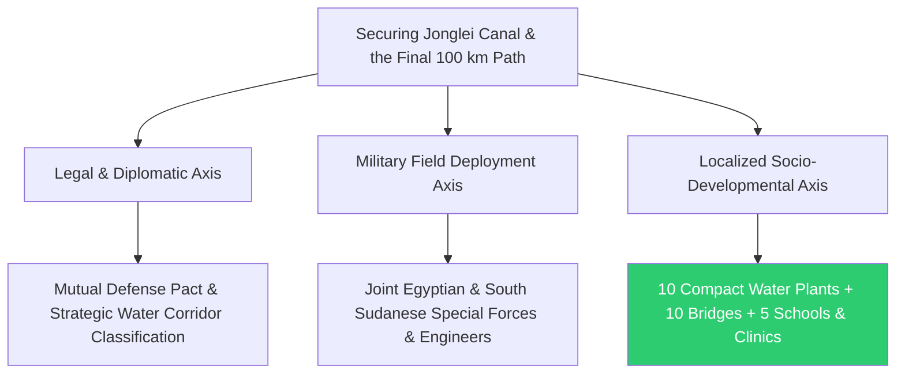
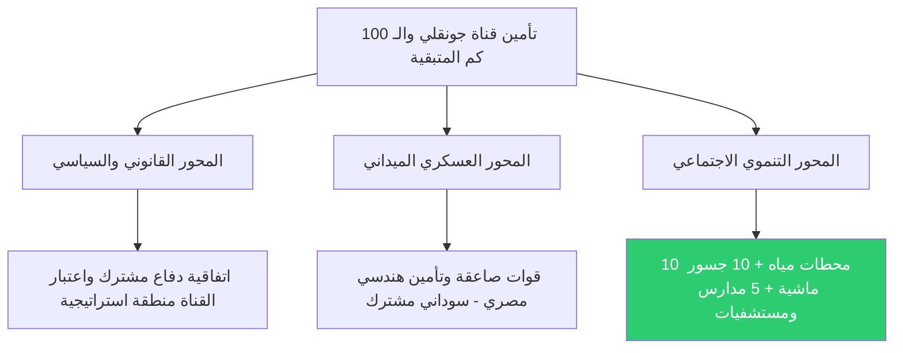

# 🗺️ Executive Framework: Linking Water Balance to Agricultural Revolution & Securing Strategic Nile Shares 🚀

This document formulates the trans-boundary geopolitical clauses, sovereign agreements, and technical feasibility studies designed to secure an annual inflow of **90 Billion Cubic Meters (BCM)**. It integrates energy and water systems across Egypt, Sudan, Ethiopia, and South Sudan, cross-linking them with the output of the Circular Artificial River and cloud seeding metrics for the 2026 operational year.

---

## 📜 Intellectual Property & Ownership Notice

All sovereign diplomatic protocols, cross-border energy frameworks, technical configurations, and contingency layouts contained in this repository are the exclusive intellectual property of:

* **Chief Engineer / Author:** AWSAN ADEL ABDULBARI AHMED SULTAN
* **National ID / Passport No:** 01010305468 (YEMEN)
* **Corporate Entity:** AWSAN DEW FOR MARKETING SERVICES
* **Contact Phone:** +967 777 852 433

---

## ⚡ 1. The "Water-for-Energy" Protocol & Ethiopian Electricity Procurement

### A. Sovereign Prerequisites for the Protocol
Activating this axis requires executing two binding international treaties backed by the UN Security Council and the African Union to ensure structural legal enforcement:
* **Binding Hydraulic Operational Agreement:** Ethiopia legally commits to releasing a continuous minimum baseline of **35 BCM/year** from the Blue Nile dedicated to hydroelectric generation (power generation passes water downstream without consumptive depletion).
* **Long-Term Power Purchase Agreement (PPA):** A 25-year legally binding contract where Egypt guarantees the purchase of a fixed block of power, legally preventing Ethiopia from diverting reservoir waters toward asymmetric, upstream agricultural irrigation networks that could deplete down-stream flows.

### B. Egypt's Energy Demands, Transmission, & Capacity
* **Maximum Operational Capacity:** The Grand Ethiopian Renaissance Dam (GERD) features a peak capacity of **5,150 MW**, but the continuous sustainable baseline output (Firm Capacity) factoring in seasonal reservoir fluctuations sits at **4,000 MW**.
* **Grid Distribution Layout:** Egypt absorbs the 4,000 MW via ultra-high voltage (500 kV) transmission lines extending across Sudan directly to Aswan. Instead of full domestic consumption, Egypt utilizes this volume **as transit energy for re-export to Europe via the GREGY Interconnection Project with Greece**, yielding highly lucrative USD-denominated revenues.

### C. Competitive Pricing ($0.035/kWh) vs. Domestic Egyptian Baselines
* **Domestic Gas-Fired & Thermal Generation:** Local baseline generation from gas plants costs approximately **$0.105/kWh** due to the heavy financial burden of importing liquefied natural gas (LNG) and fuel oils. Purchasing at **$0.035/kWh** slashes fuel overheads by two-thirds.
* **Domestic Solar Generation:** While commercial solar projects in Egypt deliver power at **$0.025 to $0.030/kWh**, the Ethiopian hydro import excels as a **continuous, 24/7 base-load power source**, eliminating the need for capital-intensive industrial utility battery storage systems.

---

## 🌲 2. Silt Mitigation Check Dams & Agro-Forestry in the Ethiopian Highlands

* **Quantity & Capacity Matrix:** Construction of **22 specialized stone and masonry check dams** within the primary sub-basins feeding the Blue Nile, featuring an accumulation capacity of **1.5 to 2 Million m³ per dam** (Total combined retention capacity of 40 Million m³).
* **50-Million Tree Planting Architecture:** Planting native, fast-growing, high-root-density trees (e.g., Acacia) across **120,000 acres** of vulnerable mountain slopes to trap **45 Million m³ of upstream silt annually**, directly extending the active lifespan of both GERD and the Aswan High Dam.
* **Capital Payback Amortization Horizon:** Total capital investment stands at **$380 Million USD** (Egypt participating as a 60% direct financial partner). The indirect payback period is clocked at **7 years**, achieved through massive reductions in the dredging budgets of Lake Nasser and securing historic water inflow stability.

---

## 🪖 3. Diplomatic & Defensive Security Axes for the Jonglei Canal Path

Securing the completion of the remaining 100 km segment and protecting the mega bucket-wheel excavator "Toot We-She" requires a tri-axial protective ecosystem:

* **Legal & Diplomatic Axis:** Execute a mutual defense pact and water facility protection treaty between Cairo and Juba, classifying the entire canal zone as a Joint Strategic Security Corridor.
* **Military Field Deployment Axis:** Form specialized combat engineering and rapid-deployment battalions combining Egyptian Special Forces and the South Sudanese Army. Establish fixed checkpoints and continuous drone-monitored patrols across the 100 km corridor to eliminate security threats.
* **Localized Socio-Developmental Axis:** Construct essential social infrastructure (10 compact water treatment plants, 10 livestock bridges, 5 schools, and 5 clinics) funded entirely by the surrounding weed biorefineries to secure the absolute allegiance of the Dinka tribes, converting them into localized asset guardians.

---

## ⛽ 4. Aquatic Biomass Weed Clearing & Bio-Refinery Systems

### A. Geographic Targeting & Annual Yield Capacities:
* **The Bahr El Ghazal Swamp Triangle:** Extracting 70,000 Wet Tons/year of invasive weeds $\rightarrow$ Producing 14 Million Liters of Green Biodiesel + 18 Million m³ of Biomethane Gas.
* **The Sobat River Basin & Lake No Outlet:** Extracting 50,000 Wet Tons/year of invasive weeds $\rightarrow$ Producing 10 Million Liters of Green Biodiesel + 12 Million m³ of Biomethane Gas.
* **Financial Integration:** Total river clearing operations absorb $12 Million USD annually, offset by **$28.2 Million USD** in gross product sales, yielding a **$16.2 Million USD net annual profit** dedicated to clearing Central Bank liabilities.

### B. Electromechanical Process & Bio-Conversion Train:
* **Amphibious Harvesting Fleet:** Deploy **6 intelligent amphibious weed harvesters** to cut, vacuum, and lift dense water hyacinth and papyrus blocks, clearing blocks to salvage **4 Billion m³ of water annually** lost to evapotranspiration.
* **Biorefinery Processing:** Transit biomass to the Juba and Malakal facilities, dropping moisture to under 15% before feeding it into fast-pyrolysis reactors at 500°C to extract green diesel for excavator operations, while routing high-nutrient organic juices into anaerobic digesters for clean biomethane electricity generation.

---

## 🌊 5. Feasibility Study: "The Great Circular Artificial River"

* **Geospatial Path Routing:** A 450 km lined artificial open channel, insulated with premium dual geomembrane sheets, featuring a constant width of 12 meters. It extends from west of Alexandria (El Hammam), running parallel to the International Coastal Road down to the desert hinterlands of Salloum.
* **Capital Expenditures (CAPEX Framework):** **$4.2 Billion USD** ($2.1 Billion for 4 mega Seawater Reverse Osmosis plants integrated with Concentrated Solar Power (CSP), $1.2 Billion for excavation and channel geomembrane lining, and $900 Million for 6 heavy-duty hydraulic lifting stations and pipeline networks).
* **Technical Engineering & Crop Generation:** Delivers a continuous baseline flow of **4 Million m³/day** (1.46 BCM/year), reclaiming **800,000 acres** of desert to generate 1.08 Million Tons of strategic wheat and 960,000 Tons of yellow corn annually.
* **Financial Performance Indicators:** Water production and delivery cost is locked at **$0.52/m³**. The infrastructure yields an internal rate of return (IRR) of **14.2%** with a capital payback horizon of **8.5 years**.

---

## 🌧️ 6. Evapotranspiration and Hydrological Loss Models for Cloud Seeding

The net usable water yield of **350 Million m³ annually**, allocated for rain-fed wheat farming across the Mediterranean coast and North Sinai, is calculated after applying strict meteorological loss deductions:
* **Gross Injected Rainfall Volume (Theoretical Yield):** 540 Million m³ annually post-cloud seeding.
* **Deduction for Evaporation During Fall (Virga Losses):** **15% reduction** applied due to strong sub-cloud thermal updrafts.
* **Deduction for Surface Retention & Wild Vegetation Interception:** **20% reduction** applied to water trapped by uncultivated desert brush immediately after sunrise.
* **Net Effective Hydraulic Inflow (65% Net Yield):** Equates to exactly **350 Million m³ annually**, channeled directly into shallow coastal aquifers and collected via engineered wadi-dams and micro-catchments.

---

## 🔮 7. Long-Term System Scaling & Strategic Expansion Roadmap

* **Continental High-Voltage Smart Grid Linking:** Expand the tripartite ultra-high voltage infrastructure into a comprehensive East African Power Pool, enabling real-time trading of hydroelectric energy across a unified energy stock exchange managed out of Cairo.
* **Industrial Agro-Logistic Corridor Conversion:** Leverage the 450 km Circular River buffer zone to install sub-surface smart grain silos, modular vegetable oil extraction plants, and packaging terminals designed for direct export through the deep-water ports of Gargoub and Alexandria.

---

## ⚠️ 8. Sovereign Contingency & Strategic Risk Management Protocols

### Axis I: Ethiopia Invokes "Force Majeure" and Throttles Blue Nile Discharges

* **Risk Profile:** Geopolitical disruption or internal domestic instability prompts Addis Ababa to violate the treaty, halting the 35 BCM baseline release.
* **Mitigation Protocol:** Immediately activate the Horn of Africa Mutual Defense Treaties. Trigger emergency hydraulic protocols at the Aswan High Dam to release deep-storage reserves through the Toshka Spillway. Simultaneously, step up the Mediterranean Circular River desalination plants to 100% maximum surge capacity, and cut off all upstream electricity transmission corridors to apply immediate economic pressure.

### Axis II: Embankment Collapse or Geomembrane Rupture Along the Circular River
* **Risk Profile:** Sudden seismic shifts or flash desert sinkholes rupture the geomembrane linings, losing millions of cubic meters of desalinated water into sub-surface desert sands.
* **Mitigation Protocol:** Deploy automated flow-loss sensors to instantly isolate the compromised sector via digital slide-gates. Route active flows through parallel **Bypass Channels**. Deploy the Armed Forces Engineering Corps rapid-response teams to apply rapid-hardening concrete matrix seals, resolving structural faults within 24 hours to protect crops from moisture stress.

---
* **Sovereign Capital Protection Reserve:** **$18.5 Million USD** (Maintained as a highly liquid capital reserve window within the Central Bank of Egypt to finance immediate geopolitical, defensive, or structural emergency responses).

---
*Geospatial layout, structural programming, and systemic balancing finalized under the direct supervision and design of Eng. Awsan Adel Abdulbari Ahmed Sultan © 2026.*

---
# 🗺️ الإطار التنفيذي لربط الميزان المائي بالثورة الزراعية وحماية حصص النيل الاستراتيجية 🚀

يستهدف هذا المستند صياغة البنود الجيوسياسية، والاتفاقيات السيادية، ودراسات الجدوى الفنية العابرة للحدود لتأمين تدفق الـ **90 مليار متر مكعب سنوياً**، وتكامل مشروعات الطاقة والمياه بين مصر، السودان، إثيوبيا، وجنوب السودان، وربطها بإنتاجية "النهر الصناعي الدوار" واستمطار السحب لعام 2026.

---

## 📜 حقوق الابتكار والملكية الفكرية

* **المهندس والمبتكر الرئيسي:** أوسان عادل عبدالباري أحمد سلطان (AWSAN ADEL ABDULBARI AHMED SULTAN)
* **رقم الهوية الوطنية / الجواز:** 01010305468 (الجمهورية اليمنية - YEMEN)
* **الكيان الاعتباري المطور:** أوسان ديو لخدمات التسويق (AWSAN DEW FOR MARKETING SERVICES)
* **رقم الهاتف للتواصل:** 00967777852433

---

## ⚡ 1. بروتوكول "المياه مقابل الطاقة" وجدوى شراء الكهرباء من إثيوبيا

### أ) المتطلبات السيادية للبروتوكول
يتطلب تفعيل هذا المحور إبرام وثيقتين دوليتين برعاية مجلس الأمن والاتحاد الإفريقي لضمان الإلزام القانوني الهيكلي:
* **اتفاقية تشغيل هيدروليكي ملزمة:** تلتزم بموجبها إثيوبيا بتصريف حد أدنى لا يقل عن **35 مليار متر مكعب سنوياً** من النيل الأزرق مخصصة للتوليد الكهرمائي (التوليد يمرر المياه لولايات المصب ولا يستهلكها).
* **اتفاقية شراء طاقة (PPA) طويلة الأجل (25 سنة):** تلتزم مصر بموجبها بشراء حصة ثابتة من كهرباء السد، مما يمنع إثيوبيا قانونياً من تحويل مياه البحيرة لمشروعات ري زراعي إثيوبية جائرة قد تستنزف المجرى الرئيسي للنهر.

### ب) حاجة مصر للكهرباء وآلية توزيعها وسعتها
* **السعة التشغيلية القصوى:** تبلغ السعة القصوى لسد النهضة **5,150 ميجاوات**، لكن القدرة المستدامة نتيجة تذبذب المنسوب هي في حدود **4,000 ميجاوات**.
* **آلية التوزيع:** تستقبل مصر الـ 4,000 ميجاوات عبر خطوط ضغط عالٍ فائقة الجهد (500 كيلوفولت) ممتدة عبر السودان إلى أسوان. لا تُستهلك بالكامل محلياً، بل تُستغل **كطاقة عبور لإعادة تصديرها إلى أوروبا عبر مشروع الربط الكهربائي (GREGY) مع اليونان** لإنتاج عوائد دولارية مجزية.

### ج) مقارنة السعر التنافسي (0.035 دولار/كيلوواط) مع البدائل المحلية بمصر
* **التوليد الغازي والتقليدي بمصر:** تبلغ تكلفة إنتاج الكيلوواط من المحطات الغازية محلياً حوالي **10.5 سنت أمريكي** بسبب أعباء استيراد الغاز والمازوت. الشراء بـ **3.5 سنت** يوفر ثلثي تكلفة الوقود.
* **الطاقة الشمسية بمصر:** تبلغ تكلفة الشمسية **2.5 إلى 3 سنت**، لكن الطاقة الإثيوبية تمتاز بأنها **طاقة حمل أساسي مستمرة (Base-load) تعمل ليلاً ونهاراً** دون الحاجة لبطاريات تخزين باهظة.

---

## 🌲 2. دراسة مشروع استزراع 50 مليون شجرة وسدود الطمي بإثيوبيا

* **عدد وسعة السدود المطلوبة:** إنشاء **22 سداً ترابياً وركامياً صغيراً (Check Dams)** بحوض النيل الأزرق بسعة استيعابية تتراوح بين **1.5 إلى 2 مليون متر مكعب لكل سد** (إجمالي سعة احتجازية 40 مليون م³).
* **آلية استزراع الـ 50 مليون شجرة:** زراعة أشجار محلية كثيفة الجذور وسريعة النمو (مثل الأكاسيا) على مساحة **120 ألف فدان** من المنحدرات المحيطة لحجز **45 مليون م³ من الطمي سنوياً** وإطالة عمر سد النهضة والسد العالي.
* **الفترة الزمنية لاسترجاع قيمة المشروع:** التكلفة الاستثمارية تبلغ **380 مليون دولار** (تتحمل مصر 60% كشريك مالي). فترة استرداد رأس المال غير المباشر هي **7 سنوات** تتمثل في خفض تكاليف تطهير بحيرة ناصر وتأمين تدفق الحصة التاريخية دون تذبذب.

---

## 🪖 3. محاور ومتطلبات المسار الدبلوماسي والأمني لقناة جونقلي

تأمين استكمال الـ 100 كم المتبقية وحماية الحفار العملاق "توط وشي" يتطلب منظومة حماية ثلاثية المحاور:

* **المحور القانوني والسياسي:** توقيع اتفاقية دفاع مشترك وتأمين منشآت مائية بين القاهرة وجوبا، واعتبار القناة منطقة أمنية استراتيجية مشتركة.
* **المحور العسكري الميداني (على الأرض):** تشكيل كتائب تأمين هندسي من الجيش المصري وقوات الصاعقة بالتكامل مع جيش جنوب السودان لإنشاء نقاط مراقبة ثابتة ودوريات متحركة على طول الـ 100 كيلومتر لمنع أي هجمات مسلحة.
* **المحور التنموي (كسب الحاضنة الشعبية):** إقامة البنية التحتية الاجتماعية (10 محطات مياه مدمجة، 10 جسور ماشية, 5 مدارس ومستشفيات) المموّلة ذاتياً من مشروع الحشائش لكسب ولاء قبائل الدينكا وتحويلهم لحراس للمشروع.

---

## ⛽ 4. دراسة تطهير حشائش بحر الغزال والسوباط وإنتاج الوقود الحشوي

### أ) الاستهداف الجغرافي والسعة الإنتاجية السنوية:
* **مثلث مستنقعات بحر الغزال:** إزالة 70 ألف طن حشائش سنوياً $\rightarrow$ إنتاج 14 مليون لتر ديزل حيوي + 18 مليون م³ غاز ميثان.
* **حوض نهر السوباط ومخرج بحيرة نو:** إزالة 50 ألف طن حشائش سنوياً $\rightarrow$ إنتاج 10 ملايين لتر ديزل حيوي + 12 مليون م³ غاز ميثان.
* **الإجمالي المالي المحقق:** تكلفة التطهير 12 مليون دولار، وعوائد البيع **28.2 مليون دولار** (صافي ربح **16.2 مليون دولار سنوياً** يوجه لسداد مديونية البنك المركزي).

### ب) الآلية الفنية للتطهير والتحويل (التكامل الحيوي):
* **الحصاد الآلي:** تشغيل **6 حاصدات برمائية ذكية** لشفط وقطع نباتات ورد النيل والبردي، مما يمنع انسداد التدفق ويوفر **4 مليارات متر مكعب سنوياً** من المياه الضائعة بالبخر لشبكة النيل.
* **المعالجة الحيوية:** نقل الحشائش لمصنعي (جوبا وملكال)، وإدخالها في مفاعلات التحلل الحراري (Pyrolysis) عند 500° مئوية لإنتاج الديزل الأخضر لتموين الحفارات، وتوجيه العصير العضوي لوحدات التخمير اللاهوائي لإنتاج الغاز الحيوي وتوليد الكهرباء.

---
## 🌊 5. دراسة جدوى "النهر الصناعي العظيم الدوار" بالساحل الشمالي

* **المسار الجغرافي:** مجرى مائي مكشوف ومبطن بطبقات الجيوميمبرين بطول 450 كم وعرض 12 متراً، ممتداً من غرب الإسكندرية (الحمام) بمحاذاة الطريق الدولي الساحلي وصولاً لظهير السلوم.
* **المكونات الرأسمالية (CAPEX):** **4.2 مليار دولار أمريكي** (2.1 مليار لمحطات التحلية الـ 4 العاملة بالطاقة الشمسية المركزة، 1.2 مليار لأعمال الحفر والتبطين، 900 مليون لمحطات الرفع الست والأنابيب).
* **الجدوى الفنية والتوليد الزراعي:** يوفر تدفقاً مستدماً بحجم **4 ملايين متر مكعب يومياً** (1.46 مليار م³ سنوياً) لزراعة **800 ألف فدان** لإنتاج 1.08 مليون طن قمح و960 ألف طن ذرة صفراء سنوياً.
* **الجدوى التشغيلية والمالية:** تكلفة إنتاج وضخ المتر المكعب هي **0.52 دولار**، ويحقق المشروع معدل عائد داخلي (IRR) يبلغ **14.2%** مع فترة استرداد رأس مال تصل إلى **8.5 سنوات**.

---

## 🌧️ 6. احتساب الفاقد بالبخر في مشروع استمطار السحب الاصطناعي (Cloud Seeding)

تم احتساب صافي الإنتاج المائي البالغ **350 مليون متر مكعب سنوياً** الموجه لزراعة القمح المطرى بالساحل الشمالي وسيناء بعد خصم الفواقد الهيدروليكية التالية بدقة:
* **إجمالي الهطول المطري الناتج عن التلقيح (نظرياً):** 540 مليون متر مكعب سنوياً.
* **يُخصم فاقد التبخر أثناء السقوط في الهواء (Virga):** خفض بنسبة **15%** نتيجة التيارات الصاعدة.
* **يُخصم فاقد البخر السطحي واحتجاز أوراق النباتات البرية:** خفض بنسبة **20%** فور شروق الشمس.
* **صافي المياه الفعالة المستفاد منها (65%):** تعادل **350 مليون متر مكعب سنوياً** تتدفق كمياه جوفية ضحلة وجريان سطحي مباشر يتم حصاده بالبحيرات الصناعية وسدود الإعاقة.

---

## 🔮 7. الرؤية التوسعية والخطط المستقبلية

* **الربط الكهربائي القاري الموسع:** التوسع في شبكة الضغط العالي الفائقة لتربط المنظومة الرقمية الثلاثية بشرق إفريقيا بالكامل، مما يتيح تداول الطاقة الكهرمائية والمتبادلة عبر بورصة طاقة موحدة تُدار من القاهرة.
* **تحويل النهر الدوار إلى منطقة لوجستية:** استغلال حرم النهر الصناعي بالساحل الشمالي بطول 450 كم لإنشاء صوامع تخزين غلال ذكية تحت الأرض ومصانع لإنتاج الزيوت النباتية وتعبئتها للتصدير المباشر عبر موانئ جرجوب والإسكندرية.

---

## ⚠️ 8. خطة الطوارئ والمحاور السيادية لإدارة الأزمات الكبرى

### المحور الأول: إعلان إثيوبيا حالة القوة القاهرة (Force Majeure) ووقف تصريف المياه
* **طبيعة الخطر (Risk Profile):** نكوص إثيوبيا عن الاتفاقية الملزمة نتيجة اضطرابات داخلية أو رغبتها المفاجئة في ملء إضافي، مما يهدد بنقص الـ 35 مليار م³.
* **بروتوكول المواجهة (Mitigation Protocol):** تفعيل "اتفاقية الحماية الأمنية المشتركة للقرن الإفريقي"، بالتوازي مع رفع حالة الطوارئ الهيدروليكية بالسد العالي لضخ المياه من مفيض توشكى وبحيرة ناصر، وتشغيل قنوات النهر الصناعي الدوار بالساحل الشمالي بكامل طاقتها الاستيعابية القصوى (التحلية الشمسية)، وقطع خطوط الربط الكهربائي الممتدة لأديس أبابا للضغط الاقتصادي.

### المحور الثاني: انهيار أجزاء من شبكة التبطين (الجيوميمبرين) بالنهر الصناعي الدوار
* **طبيعة الخطر (Risk Profile):** حدوث هبوط أرضي مفاجئ في التربة الصحراوية يؤدي لتمزق العوازل وتسرب ملايين الأمتار المكعبة من المياه المحلاة في باطن الأرض وخسارتها مالياً.
* **بروتوكول المواجهة (Mitigation Protocol):** الإغلاق الآلي الفوري لبوابات القطاع المتضرر عبر مستشعرات التدفق الرقمية، وتحويل المسار المائي إلى "قنوات الطوارئ التبادلية الالتفافية" (Bypass Channels)، وتحريك فرق التدخل السريع التابعة للهيئة الهندسية لإعادة صب الخرسانة سريعة الشك (Rapid-Hardening Concrete) ومعالجة الخلل خلال 24 ساعة لضمان عدم جفاف الحقول.

* **الميزانية المرصودة للطوارئ السيادية والهندسية:** **18.5 مليون دولار أمريكي** (تُحتجز احتياطياً نقديًا ائتمانياً ثابتاً في حساب المنظومة بالبنك المركزي لإدارة الاستجابات الجيوسياسية والعسكرية واللوجستية الطارئة).

---
*تمت الخارطة الهندسية والجدولة البرمجة تحت إشراف وتصميم المهندس أوسان عادل عبدالباري أحمد سلطان © 2026.*
