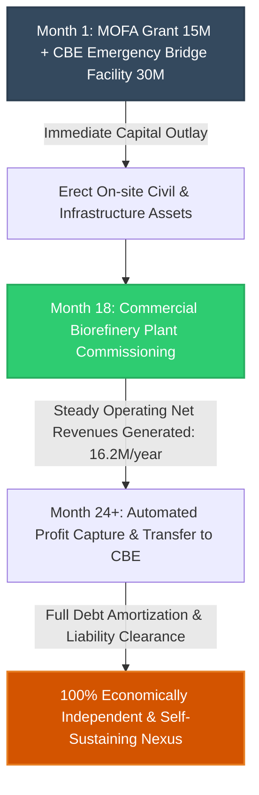
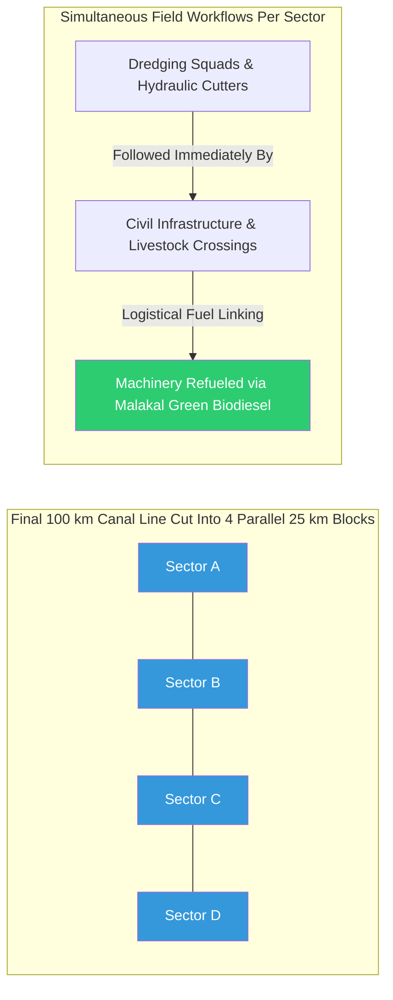
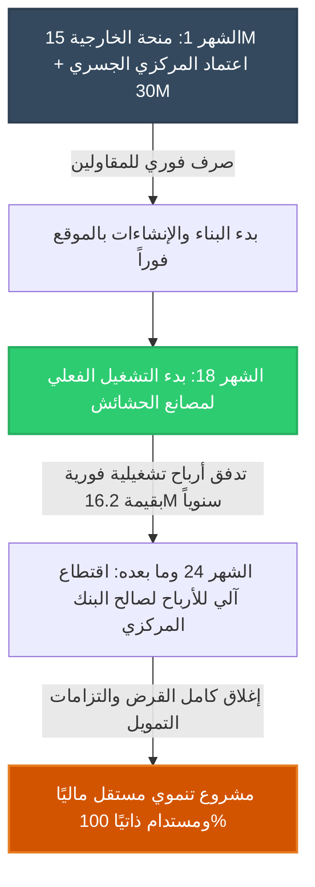
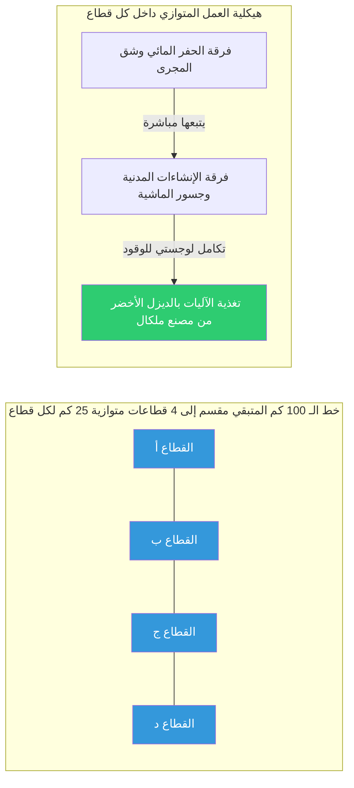

# 📅 Emergency Execution Timeline & Parallel Critical Path Method (CPM) for the Jonglei Canal System (24-Month Fast-Track) 🚀

This document delivers the structurally compressed hydraulic timeline and advanced fast-tracking engineering layouts required to dynamically merge the final 100 km canal dredging, biomass refinery construction, and parallel socio-developmental infrastructure installation into a unified **24-month (2-year) execution horizon**.

---

## 📜 Intellectual Property & Ownership Notice

All project management frameworks, critical path layouts, Gantt architectures, and parallel deployment strategies contained in this repository are the exclusive intellectual property of:

* **Chief Engineer / Author:** AWSAN ADEL ABDULBARI AHMED SULTAN
* **National ID / Passport No:** 01010305468 (YEMEN)
* **Corporate Entity:** AWSAN DEW FOR MARKETING SERVICES
* **Contact Phone:** +967 777 852 433

---

## ⏱️ 1. Emergency Timeline & Execution Phases (24 Months)

```mermaid
gantt
    title Integrated Jonglei Canal & Biorefinery Gantt Chart (24 Months)
    dateFormat  X
    axisFormat Month %m
    
    section Phase I: Mobilization & Readiness
    Refurbish "Toot We-She" Harvester & Machinery Deployment  :active, p1, 0, 6
    Fabricate Pyrolysis Process Lines at AOI Factories Egypt :active, p2, 1, 5
    Topographic Survey & Mapping for Infrastructure Coordinates :active, p3, 2, 6
    
    section Phase II: Parallel Deployment
    Hydraulic Cutter Suction Dredging for Final 100 km Segment   :crit, p4, 6, 18
    Construct Juba & Malakal Refineries & Pre-dry Biomass       :p5, 6, 15
    Build Schools, Clinics, and Engineered Livestock Crossings  :p6, 7, 18
    
    section Phase III: Commissioning & Linking
    Trial Runs, Biofuel Distribution & Grid Synchronization     :p7, 18, 22
    Official Water Release Across the Complete 360 km Canal Path :crit, p8, 22, 24
    Clear Liquidity Accounts & Pay Off CBE Bridge Loan           :p9, 22, 24
```

### 🎯 Critical Path Phase Breakdown:

#### Phase I: Mobilization & Technological Readiness (Months 1 - 6)
* **Canal Engineering Wing:** Execute full-scale overhauling and mechanical restoration of the mega bucket-wheel excavator "Toot We-She" at its current location. Mobilize helper booster pumps and auxiliary hydraulic dredgers from Egypt to South Sudan via the main river corridor while deploying the joint security task force.
* **Biomass Project Wing:** Initiate immediate engineering fabrication of fast-pyrolysis reactor blocks and anaerobic digesters inside **The Arab Organization for Industrialization (AOI) plants in Egypt**. Ship the 6 intelligent amphibious weed harvesters to Juba and Malakal.
* **Socio-Developmental Wing:** Conduct advanced topographic and geospatial surveys to map the final engineering coordinates for the 10 compact water treatment plants, 10 livestock bridges, 5 schools, and 5 clinics based on the migration densities of the Dinka tribes.

#### Phase II: Intensive Parallel Deployment (Months 7 - 18)
* **Canal Engineering Wing:** Launch high-velocity, round-the-clock dredging operations along the remaining 100 km path using rotating shifts (24/7 continuous operations).
* **Biomass Project Wing:** Cast concrete foundations and erect structural steel framing for the Juba and Malakal refineries. Deploy the amphibious harvesters to cut, lift, and stack aquatic biomass for open-air pre-drying cycles.
* **Socio-Developmental Wing:** Deploy national engineering contractors to build the concrete livestock bridges right behind the active dredging path. Assemble pre-fabricated modular panels to construct the schools and clinics rapidly.

#### Phase III: Commissioning & Cross-Financial Integration (Months 19 - 24)
* **Canal Engineering Wing:** Complete the final 5 kilometers of dredging and clear the entire 360 km canal channel of any residual blocks to prepare for the hydro-load.
* **Biomass Project Wing:** Open commercial reactor cycles, pump the first batches of green biodiesel, link biomethane generators to rural grids, and channel initial cash revenues directly into the cross-subsidization clearing accounts.
* **Socio-Developmental Wing:** Officially open the water treatment plants, clinics, and schools under local tribal protection. Activate the automatic cross-subsidization flow to settle the Central Bank's emergency bridge loan.

---

## 📈 2. Parallel Deployment Architecture (Cross-Subsidized Engineering)

### A. Parallel Financial Flow (Reciprocal Cross-Subsidization Workflow)

### B. Integrated On-Site Operations (Final 100 km Path Layout)

* **Dynamic Field Execution:** Contractors execute workloads simultaneously across all sectors (A, B, C, and D). Civil squads build livestock crossings and compact water units immediately as dredging passes, ensuring cattle migration routes are perfectly preserved mid-operation. A 22% operational fuel saving is unlocked via direct consumption of early-batch green biodiesel to power site machinery.

---

## 🔮 3. Tectonic System Scaling & Future Expansion (Post 24-Month Horizon)

* **IoT Hydraulic Canal Automation:** Integrate a real-time, sensor-driven hydrological data network (IoT telemetry) across the full 360 km Jonglei canal line to monitor flow velocities, embankment stability, and silt accumulation rates, streaming data directly to the central Tripartite Digital System.
* **Trans-Continental Inland Commercial Trade Corridor:** Structure advanced feasibility studies to dynamically widen and reinforce the canal embankments, transforming it into a high-capacity commercial shipping lane linking Juba to Aswan to lower regional bulk freight costs.

---

## ⚠️ 4. Emergency Contingency & Critical Path Risk Mitigation

To bulletproof the strict 24-month schedule and protect Egypt’s incoming 4.5 BCM/year inflow, the following active engineering risk protocols are established:

### Axis I: Extreme Flash Floods in the Sudd Swamps
* **Risk Profile:** Asymmetric, climate-driven rise in regional marsh water levels inundates structural footings of schools, clinics, and water plants, completely stalling wheeled machinery.
* **Mitigation Protocol:** Immediately freeze traditional shallow masonry operations. Pivot construction crews to install **Deep Piled Foundations** engineered for sub-surface saturation. Deploy heavy amphibious pontoon platforms to transport ready-mix concrete and shift dredging targets to elevated topographies to avoid losing workdays.

### Axis II: Logistics Logjams in Biorefinery Reactor Shipping
* **Risk Profile:** Global supply chain shocks or customs friction delays the transit of micro-components for the fast-pyrolysis reactors from Egyptian factories, missing the Month 18 deadline.
* **Mitigation Protocol:** Maintain continuous amphibious harvesting schedules but store, compact, and dry the biomass inside secure, ventilated modular silos (Biomass Silos). Active the anaerobic digestion lines early to process wet biomass sludge into biomethane, providing local electricity while waiting for the main pyrolysis blocks to arrive.

### Axis III: Localized Technical Labor Force Scarcity
* **Risk Profile:** Tribal friction or steep learning curves for advanced industrial machinery causes local workforce turnover, creating operational labor deficits.
* **Mitigation Protocol:** Deploy **The Egyptian Armed Forces Engineering Corps elite rapid-response battalions**, who are pre-trained on amphibious harvesting and modular civil works, to manage the automated facilities at 100% capacity. Simultaneously, scale up financial and in-kind food incentives for local workers to re-establish community stabilization and trust.
* **Emergency Scheduling Capital:** **$5.5 Million USD** (Withheld and held as a highly liquid capital protection buffer inside the project's central sovereign risk fund).

---
*Document formulated, structurally engineered, and programmed under the direct supervision and design of Eng. Awsan Adel Abdulbari Ahmed Sultan © 2026.*

---
# 📅 الجدول الزمني الطارئ ومخطط المسار الحرج المتوازي لمنظومة "قناة جونقلي" (24 شهراً) 🚀

تستهدف هذه الوثيقة تفكيك الجدول الزمني الهيدروليكي المضغوط، وآليات الهندسة التنفيذية المتوازية (Fast-Tracking) لدمج أعمال الحفر لخط الـ 100 كم المتبقي، وإنشاء مصانع الحشائش، وتشييد البنية التحتية التنموية في إطار زمني موحد لا يتجاوز **24 شهراً (عامين فقط)**.

---

## 📜 حقوق الابتكار والملكية الفكرية

* **المهندس والمبتكر الرئيسي:** أوسان عادل عبدالباري أحمد سلطان (AWSAN ADEL ABDULBARI AHMED SULTAN)
* **رقم الهوية الوطنية / الجواز:** 01010305468 (الجمهورية اليمنية - YEMEN)
* **الكيان الاعتباري المطور:** أوسان دو لخدمات التسويق (AWSAN DEW FOR MARKETING SERVICES)
* **رقم الهاتف للتواصل:** 00967777852433

---

## ⏱️ أولاً: الجدول الزمني الطارئ ومراحل التنفيذ (24 شهراً)

```mermaid
gantt
    title مخطط غانت التنفيذي لمنظومة جونقلي والحشائش (24 شهراً)
    dateFormat  X
    axisFormat %m شهر
    
    section المرحلة الأولى: الحشد والجهوزية
    تأهيل الحفار توط وشي وصيانة الآليات      :active, p1, 0, 6
    تصنيع خطوط التحلل الحراري بالهيئة العربية    :active, p2, 1, 5
    المسح الطبوغرافي وتحديد مواقع المحطات والمدارس :active, p3, 2, 6
    
    section المرحلة الثانية: التنفيذ المتوازي
    أعمال الشق الهيدروليكي للـ 100 كم المتبقية    :crit, p4, 6, 18
    إنشاء مصانع جوبا وملكال وتشوين الحشائش   :p5, 6, 15
    بناء المدارس والمستشفيات وجسور الماشية       :p6, 7, 18
    
    section المرحلة الثالثة: التشغيل والربط
    التشغيل التجريبي وضخ الوقود الحيوي والمياه :p7, 18, 22
    إطلاق المياه رسميًا في مجرى القناة بالكامل   :crit, p8, 22, 24
    استلام وإغلاق مديونية البنك المركزي المصري   :p9, 22, 24
```

### 🎯 تفصيل المراحل الزمنية للمسار الحرج:

#### 1. المرحلة الأولى: الحشد والجهوزية التكنولوجية (الأشهر 1 - 6)
* **المسار الهندسي للقناة:** إتمام الصيانة الشاملة للحفار العملاق "توط وشي" في موقع توقفه، ونقل معدات التجريف المساعدة والشفاطات الهيدروليكية من مصر إلى جنوب السودان عبر المجرى النهري، مع نشر قوات التأمين المشتركة.
* **مسار مشروع الحشائش:** بدء التصنيع الفوري لخطوط التحلل الحراري (Pyrolysis) ومخمرات التخمير اللاهوائي داخل **مصانع الهيئة العربية للتصنيع في مصر**، وشحن 6 حاصدات برمائية ذكية إلى جوبا وملكال.
* **المسار التنموي الاجتماعي:** إجراء الرفع المساحي الطبوغرافي لتحديد الإحداثيات الهندسية النهائية للـ 10 محطات مياه مدمجة، والـ 10 جسور، والـ 5 مدارس ومراكز طبية بناءً على الكثافة الرعوية لقبائل الدينكا.

#### 2. المرحلة الثانية: التنفيذ المتوازي المكثف (الأشهر 7 - 18)
* **المسار الهندسي للقناة:** انطلاق قوافل الحفر المائي للمسار المتبقي بمعدل إنتاجية متسارع على مدار 24 ساعة (نظام ورديات دائرية).
* **مسار مشروع الحشائش:** صب القواعد الخرسانية وتركيب هياكل مصانع التحويل الحيوي في (جوبا وملكال)، وانطلاق الحاصدات البرمائية لفرز وتشوين الحشائش لتجفيفها أوليّاً.
* **المسار التنموي الاجتماعي:** نزول شركات المقاولات الوطنية لتشييد الجسور الخرسانية للماشية بالتوازي مع زحف الحفار، وبناء المدارس والمستشفيات باستغلال مواد البناء سابقة التجهيز.

#### 3. المرحلة الثالثة: التشغيل التجريبي والربط المالي التكاملي (الأشهر 19 - 24)
* **المسار الهندسي للقناة:** إنهاء آخر 5 كيلومترات من الشق، وتطهير مجرى الـ 360 كم بالكامل من أي عوائق استعداداً لإطلاق المياه.
* **مسار مشروع الحشائش:** بدء التشغيل التجاري الفعلي للمفاعلات، وضخ أولى شحنات الديزل الحيوي، وربط الميثان الحيوي بمولدات القرى الساحلية، وبدء تحويل الأرباح النقدية لصندوق المقاصة.
* **المسار التنموي الاجتماعي:** افتتاح المحطات والمستشفيات والمدارس رسمياً وتأمينها من الحاضنة الشعبية، والبدء الفعلي لربط عوائد الحشائش لسداد القرض الجسري للبنك المركزي.

---

## 📈 ثانياً: آلية التنفيذ المتوازي والتكاملي (هندسة التمويل المتبادل)

### 1. التدفق المالي المتوازي (التكامل والحل المالي التبادلي)
لضمان عدم تأخر أعمال البناء الإنشائية لخدمات القبائل لحين بدء تشغيل مصانع الحشائش، تم ابتكار **"آلية التمويل الجسري والاسترداد المتتابع"**:

### 2. التنفيذ الميداني المتكامل على خط الـ 100 كم المتبقي

* **التكامل الميداني الفعلي:** يعمل المقاولون بالتوازي في كافة القطاعات (أ، ب، ج، د)، حيث تشيد فرقة الإنشاءات المدنية جسور الماشية ومحطات المياه المدمجة فور انتهاء أعمال الحفر بالقطاع مباشرة لضمان عدم تأثر حركة الرعاة. ويتم تحقيق وفر تشغيلي بنسبة 22% عبر استهلاك الديزل الحيوي المنتج تجريبياً لتموين معدات وآليات المشروع.

---

## 🔮 ثالثاً: الرؤية التوسعية والخطط المستقبلية (ما بعد الـ 24 شهراً)

* **أتمتة المجرى المائي ورقمنته:** دمج منظومة رصد هيدروليكية ذكية (IoT) على طول الـ 360 كم لقناة جونقلي لمراقبة سرعة تدفق المياه ومستويات الإطماء آلياً وإرسال البيانات للمنظومة الرقمية الثلاثية.
* **توسيع الممر الملاحي للتجارة:** دراسة تطوير أكتاف القناة وجسورها هندسياً في المستقبل لتحويلها إلى ممر ملاحي نهري يربط جوبا بأسوان، لتبادل البضائع والمنتجات الزراعية والحيوانية بأسعار شحن منخفضة.

---

## ⚠️ رابعاً: خطة الطوارئ والمحاور التشغيلية لإدارة الأزمات الزمنية واللوجستية

لحماية الإطار الزمني الصارم (24 شهراً) ومنع أي تأخير في إطلاق الـ 4.5 مليار متر مكعب السنوية لمصر، تم وضع المحاور التالية:

### المحور 1: الفيضانات الاستثنائية المفاجئة في مستنقعات جنوب السودان
* **الخطر:** ارتفاع منسوب مياه المستنقعات بشكل غير متوقع يؤدي إلى غمر مواقع بناء المدارس ومحطات المياه وشل حركة الآليات.
* **إجراءات الطوارئ:** إيقاف أعمال البناء المدني التقليدي فوراً، والتحول إلى استخدام **"الأساسات الخازوقية العميقة" (Piled Foundations)** المقاومة للغمر، والاستعانة بالمنصات البرمائية الثقيلة لنقل الخرسانات الجاهزة، مع تعديل مسار حفر القناة للتركيز على القطاعات المرتفعة طبوغرافياً لضمان عدم خسارة أيام العمل.

### المحور 2: تأخر توريد المفاعلات الحيوية من المصانع المصرية
* **الخطر:** حدوث اختناقات لوجستية في الشحن أو نقص في سلاسل توريد الأجزاء الإلكترونية الدقيقة لمفاعلات التحلل الحراري (Pyrolysis)، مما يؤخر تشغيل المصانع في الشهر 18.
* **إجراءات الطوارئ:** تمديد تشغيل الحاصدات البرمائية لحصاد وتكثيف وتجفيف الحشائش وتخزينها في صوامع مغلقة مؤقتة (Biomass Silos)، مع تفعيل خطة "الإنتاج الحيوي الأولي" القائم على خزانات التخمير اللاهوائي البسيطة لإنتاج الغاز الحيوي وتشغيل شبكات الكهرباء المحلية لحين وصول مفاعلات الديزل وتكامل المنظومة.

### المحور 3: نقص العمالة الفنية المدربة في المواقع
* **الخطر:** حدوث تسرّب أو توقف للعمالة المحلية من القبائل نتيجة خلافات داخلية أو صعوبة التكيف مع الآلات الحديثة.
* **إجراءات الطوارئ:** الدفع الفوري بـ **"كتائب الدعم الهندسي" من القوات المسلحة المصرية** الجاهزة والمدربة مسبقاً على إدارة الحاصدات البرمائية ومعدات البناء الجاهز لإدارة المواقع بكفاءة 100%، بالتوازي مع زيادة الحوافز المالية والغذائية العينية للعمالة المحلية لاستعادتهم وضمان ولائهم للمشروع.
* **الميزانية المرصودة لطوارئ الجدول الزمني واللوجستيات:** **5.5 مليون دولار أمريكي** (تُحتجز احتياطياً نقدياً سائلاً لتغطية نفقات النقل الجوي الطارئ لقطع الغيار أو استقدام فرق دعم هندسية فورية).

---
*تمت الصياغة والتوثيق البرمجي تحت إشراف وتصميم المهندس أوسان عادل عبدالباري أحمد سلطان © 2026.*

