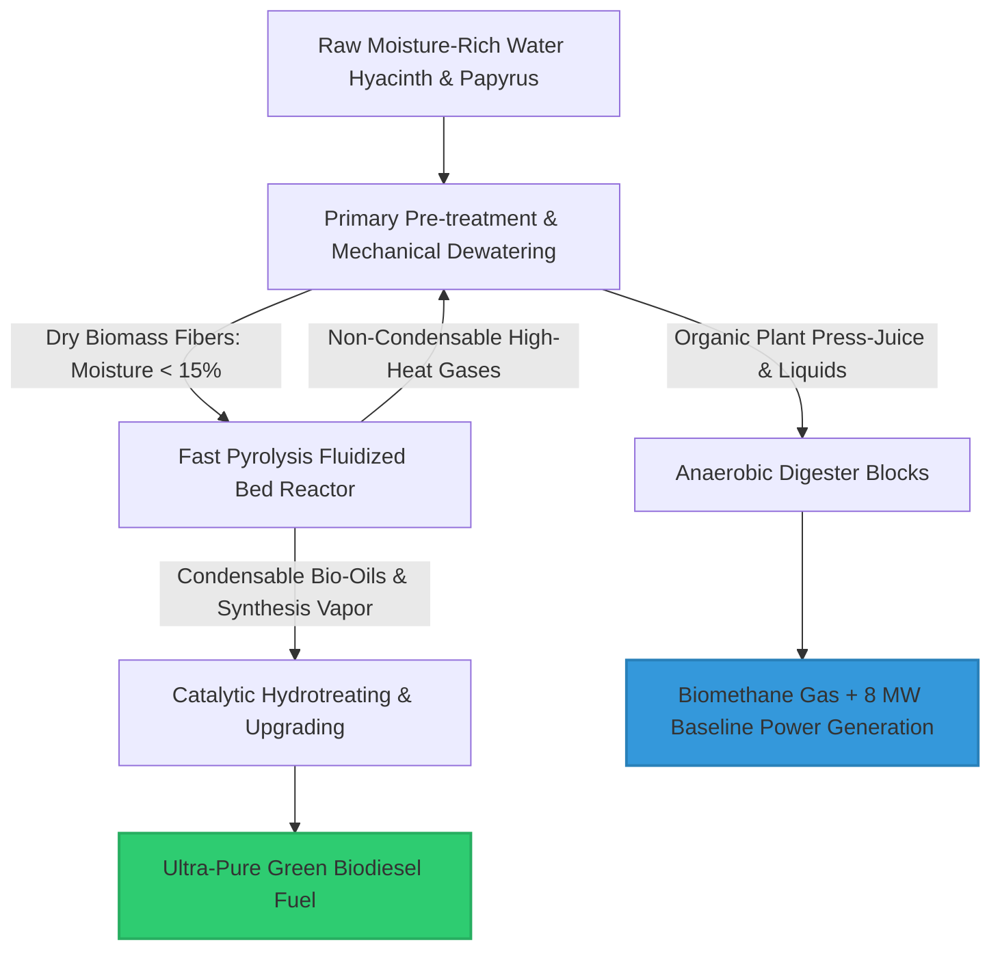
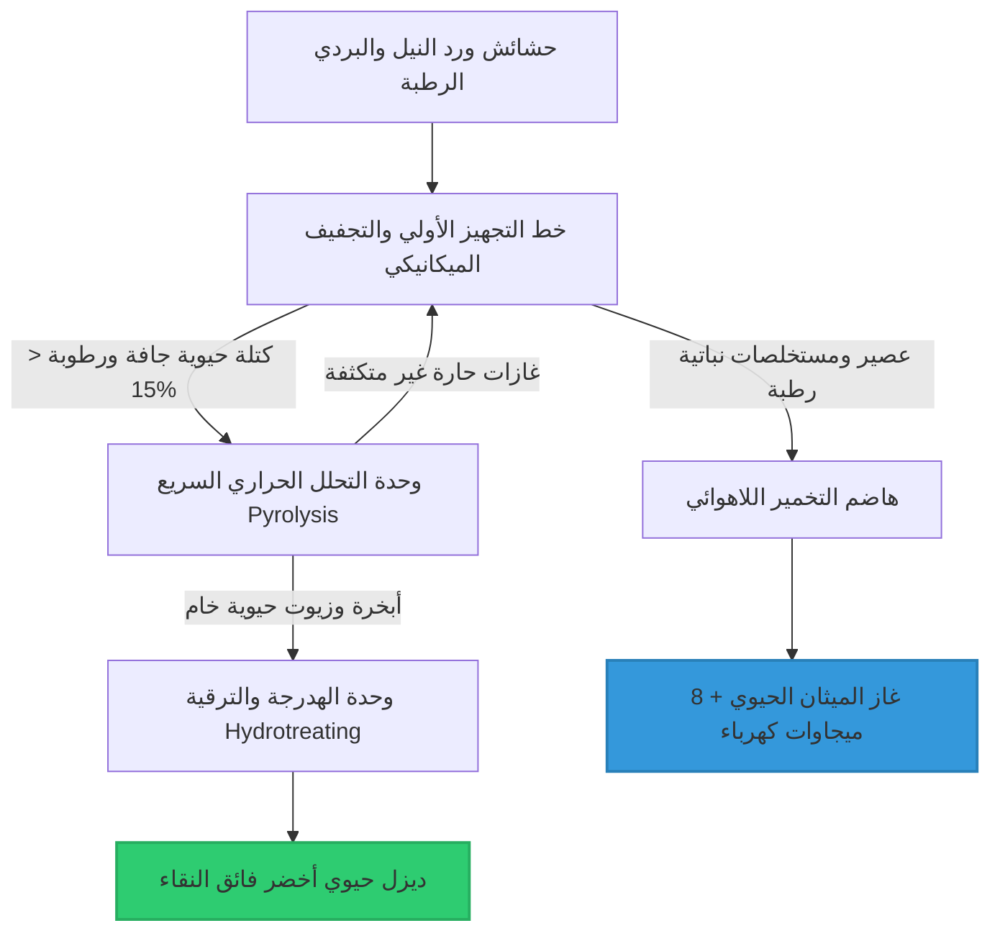

# 🌊 Structural Budgeting & Technical Feasibility Study for the Jonglei Canal & Bio-Refineries 🚀

This document compiles and archives the comprehensive financial allocations, advanced technological specifications, and Capital Expenditure (CAPEX) models mapping out the integration of the 360 km Jonglei Canal system with the dual biomass processing facilities in Juba and Malakal.

---

## 📜 Intellectual Property & Ownership Notice

All technical blueprints, financial budgeting models, thermodynamic workflows, and asset feasibility matrices contained in this repository are the exclusive intellectual property of:

* **Chief Engineer / Author:** AWSAN ADEL ABDULBARI AHMED SULTAN
* **National ID / Passport No:** 01010305468 (YEMEN)
* **Corporate Entity:** AWSAN DEW FOR MARKETING SERVICES
* **Contact Phone:** +967 777 852 433

---

## 💰 1. Financing Structure & Status of the Jonglei Canal (360 km Total / 100 km Remaining)

### A. Core Dredging & Channel Excavation Budget
* **Current Status:** 260 km out of 360 km have been successfully excavated and cleared. The capital required to finish the remaining 100 km is fully secured and carries no new external debt burdens.
* **Covered Line-Items:** All recurring costs—including the overhaul and active operations of the mega bucket-wheel excavator "Toot We-She", salaries for Egyptian engineering consultants, heavy machinery fuel consumption, field logistics, and continuous site security—are fully covered under the "National Projects for Upper Nile Inflows" budget, distributed by the Permanent Joint Technical Commission for Nile Waters (Egypt).

### B. Socio-Developmental Package Budget for the Final 100 km Segment
* **The Core Challenge:** Historical project planning concentrated solely on the hydraulic engineering of the channel, completely omitting a parallel localized socio-developmental package for the pastoralist Dinka tribes. This critical gap led to past community friction and halted works at the 70% threshold.
* **The Funding Solution:** Deploy a standalone **$45 Million USD** dedicated socio-economic budget split via the Parallel Financial Flow system: $15 Million USD as a non-repayable humanitarian grant from the Ministry of Foreign Affairs (EAPD) and $30 Million USD as an emergency bridge loan from the Central Bank of Egypt, fully amortized through biorefinery profits.

---

## ⚙️ 2. Industrial Feasibility & Process Layout for the Juba & Malakal Refineries

### A. Electromechanical Equipment & Technology Train Specifications (Per Facility)

* **Primary Pre-treatment & Mechanical Dewatering:**
  * Heavy-duty industrial shredders with reinforced alloy steel blades to slice thick papyrus stocks into uniform 2–5 cm fragments.
  * Specialized high-pressure screw presses to mechanically extract cell moisture, driving core fiber humidity levels down from 90% to 50%.
  * Continuous rotary drum dryers that capture recycled thermal energy from the reactors to finish drying fibers down to **under 15% moisture content**.
* **Fast Pyrolysis Fluidized Bed Reactors:**
  * High-efficiency thermal reactors operating at exactly **500°C in a complete zero-oxygen atmosphere**, instantly decomposing dry organic matter into carbon vapors and stable biochar.
* **Catalytic Hydrotreating & Upgrading Systems:**
  * High-pressure chemical synthesis loops utilizing specialized catalysts to completely deoxygenate raw bio-oil vapors, producing clean green diesel fully compatible with commercial engine systems.
* **Anaerobic Digester Blocks:**
  * Thermally insulated concrete containment tanks with continuous mechanical mixing apparatuses engineered to process extracted organic press-juice into stable, pipeline-grade biomethane gas.

---

### B. Comprehensive Capital Expenditure Breakdown (Combined CAPEX for Both Facilities)

| Engineering & Civil Work Allocation | Cost in Millions USD | Technical Specifications & Procurement Focus |
| :--- | :---: | :--- |
| **Amphibious Fleet Acquisition** | $6.00 Million USD | Procurement of 6 intelligent amphibious weed harvesters fitted with hydraulic cutting arms. |
| **Shredding & Dewatering Lines** | $5.00 Million USD | Multi-stage industrial shredders, mechanical screw presses, and rotary drum dryers for both locations. |
| **Pyrolysis Reactors & Upgrading Blocks** | $14.00 Million USD | 500°C fast pyrolysis units and catalytic hydro-treaters for premium green diesel extraction. |
| **Digesters & Gas Turbine Generators** | $7.00 Million USD | Large-volume anaerobic digestions loops linked to 8 MW baseline gas turbine generators. |
| **Site Civil Works & Utilities Infrastructure** | $3.00 Million USD | Grading, structural concrete slab pouring, pipeline routing, and heavy warehouse framing. |
| **Total Capital Expenditure (CAPEX)** | **$35.00 Million USD** | **Complete capital required to fully commission the Juba and Malakal facilities.** |

---

### C. Laboratory-Validated Annual Process Yields
Processing **120,000 Wet Tons/year** of aquatic biomass yields approximately **30,000 Dry Tons/year** of fully dehydrated fiber post-compression, generating the following strict annual product outputs:
* **Green Biodiesel Fuel (35% Process Efficiency):** **24 Million Liters annually**. This volume directly fuels active canal excavators and contractor support fleets, with excess inventory cleared through commercial regional fuel markets.
* **Biomethane Gas & Base-Load Power:** **30 Million m³ of biomethane gas annually**, routed into gas turbines to supply **8 MW of uninterrupted electricity** to power canal infrastructure, مدارس, and hospitals along the 100 km line.
* **Stable Biochar (25% Process Efficiency):** Extraction of **7,500 Tons annually** of high-purity, stable carbon biochar, distributed as a premium moisture-retaining soil conditioner for desert reclamation fields.
* **100% Thermal Energy Self-Sufficiency:** The remaining 40% efficiency yield manifests as non-condensable synthesis gases. These gases are routed right back to fuel the system's heating jackets, making the facilities **completely energy self-sufficient**.

---

## 🔮 3. Project Scaling & Long-Term Expansion Roadmap (Post-Stabilization)

* **High-Margin Activated Carbon Processing:** Upgrade the secondary pyrolysis process lines to re-treat the raw biochar (Biochar), transforming it into technical-grade Activated Carbon. This compound will be exported to water purification and wastewater treatment plants across Egypt and the MENA region at premium market rates.
* **Regional Hydro-Tech Manufacturing Hub:** Establish mechanical assembly lines within Egypt to locally manufacture the amphibious harvesters, continuous dryers, and modular reactors, turning Egypt into a prominent sub-Saharan exporter of river-restoration technologies.

---

## ⚠️ 4. Asset Protection & Material Flow Risk Mitigation Framework

To secure continuous processing cycles and insulate heavy machinery from unexpected shutdowns, the following engineering risk axes are established:

### Axis I: Sudden Chemical Fluctuations and Flash Moisture Spikes in Biomass
* **Risk Profile:** Torrential sub-Saharan rain seasons drive aquatic weed moisture composition past the 95% threshold, overloading the rotary drum dryers and dropping pyrolysis thermal efficiency.
* **Mitigation Protocol:** Interlock the system to activate a **Dual-Stage Compaction Method** via a secondary emergency screw press line. The excess high-moisture organic liquids are bypassed directly into the anaerobic digestion tanks to scale up methane outputs, while temporarily throttling the pyrolysis feeds until natural moisture trends normalize.

### Axis II: Navigation Disruption and River Transit Closures Between Juba and Malakal
* **Risk Profile:** Localized tribal conflicts or shipping channel blocks prevent the transfer of replacement components or green fuel between the two factory locations.
* **Mitigation Protocol:** Enforce absolute "Asset Autonomy Design" for both plants from Day 1. Split the critical spare parts warehouses 50/50 and install an independent, localized **2 MW standby hybrid solar array** at each facility. This ensures complete process continuity even during a total multi-week river shipping cutoff.
* **Emergency Asset Capital Reserve:** **$3.2 Million USD** (Held as a liquid cash operational buffer to immediately cover localized emergency maintenance overhauls and backup chemical procurement).

---
*Document formulated, structurally engineered, and programmed under the direct supervision and design of Eng. Awsan Adel Abdulbari Ahmed Sultan © 2026.*

---

# 🌊 الموازنة الهيكلية ودراسة الجدوى الفنية لمحطتي التحويل الحيوي وقناة جونقلي 🚀

يستهدف هذا المستند تجميع وتوثيق البنود المالية، والمواصفات الهندسة التكنولوجية، والميزانيات الرأسمالية (CAPEX) الخاصة بمسار قناة جونقلي (الـ 360 كم) بالتكامل مع محطتي المعالجة الحيوية للحشائش المائية في (جوبا وملكال).

---

## 📜 حقوق الابتكار والملكية الفكرية

* **المهندس والمبتكر الرئيسي:** أوسان عادل عبدالباري أحمد سلطان (AWSAN ADEL ABDULBARI AHMED SULTAN)
* **رقم الهوية الوطنية / الجواز:** 01010305468 (الجمهورية اليمنية - YEMEN)
* **الكيان الاعتباري المطور:** أوسان ديو لخدمات التسويق (AWSAN DEW FOR MARKETING SERVICES)
* **رقم الهاتف للتواصل:** 00967777852433

---

## 💰 أولاً: الوضع التمويلي والهيكلي لقناة جونقلي (الـ 360 كم والـ 100 كم المتبقية)

### 1. ميزانية شق القناة الأساسية (المسار المائي)
* **الوضع القائم:** تم حفر وتطهير 260 كم من إجمالي 360 كم. الميزانية المخصصة لحفر الـ 100 كم المتبقية مغطاة بالكامل ولا تمثل عبئاً تمويلياً جديداً.
* **البنود المغطاة تشغيلياً:** تقع كافة تكاليف صيانة وتشغيل الحفار العملاق "توط وشي"، أجور المهندسين والخبراء المصريين، فواتير وقود المعدات والآليات، والخدمات اللوجستية وتأمين الموقع بالكامل تحت بند "المشروعات القومية لأعالي النيل" الممول دورياً من الهيئة الفنية الدائمة المشتركة لمياه النيل (مصر).

### 2. ميزانية الخطة التنموية الاجتماعية للـ 100 كم (المحطات، الجسور، المدارس)
* **التحدي:** البند التاريخي للمشروع يقتصر على الحفر الهندسي للمسار المائي، ويفتقر لحزمة دعم اجتماعي لقبائل "الدينكا" الرعوية، وهو السبب الرئيسي للاعتراضات المحلية السابقة التي أدت لتوقف المشروع عند نسبة 70%.
* **الحل التمويلي المقترح:** رصد ميزانية مستقلة بقيمة **45 مليون دولار أمريكي** تُقسم عبر التدفق المالي المتوازي (15 مليون دولار منحة من وزارة الخارجية عبر وكالة الشراكة من أجل التنمية، و30 مليون دولار اعتماد جسري طارئ من البنك المركزي المصري يُسترد بالكامل من أرباح مشروع الحشائش).

---

## ⚙️ ثانياً: دراسة الجدوى الفنية والمتطلبات لمحطتي جوبا وملكال

### 1. متطلبات المعدات والخطوط التكنولوجية (المواصفات لكل مصنع)

* **أ) خط التجهيز الأولي والتجفيف الميكانيكي:**
  * مفارم هيدروليكية ذات سكاكين فولاذية لتقطيع الحشائش وجزيئات البردي إلى حجم (2-5 سم).
  * مكابس تجفيف حلزونية (Screw Presses) لعصر الحشائش ميكانيكياً لخفض رطوبة الألياف من 90% إلى 50%.
  * مجفف دوار مستمر (Rotary Drum Dryer) يستغل الغازات الحارة لخفض الرطوبة النهائية لأقل من 15%.
* **ب) وحدة التحلل الحراري السريع (Pyrolysis Unit):**
  * مفاعل ذو سرير مميع (Fluidized Bed) يعمل عند 500° مئوية بمعزل كامل عن الأكسجين لتحويل الألياف إلى أبخرة كربونية وفحم حيوي.
* **ج) وحدة الهدرجة والترقية (Hydrotreating System):**
  * مفاعل كيميائي مدعوم بعوامل حفازة لكسر جزيئات الأكسجين من الزيت الحيوي الخام وتحويله إلى ديزل أخضر نقي مطابق للمواصفات العالمية للمحركات.
* **د) هاضم التخمير اللاهوائي (Anaerobic Digester):**
  * خزانات خرسانية عملاقة معزولة ومبطنة بمعدات خلط مستمر لاستقبال عصير الحشائش والسوائل العضوية المكبوسة لإنتاج غاز الميثان.

---

### 2. الميزانية التقديرية التفصيلية للمعدات والإنشاءات (CAPEX الموحد للمصنعين)

| البند الهندسي والإنشائي | التكلفة بالمليون دولار | الوصف والتفصيل الفني |
| :--- | :---: | :--- |
| **أسطول الحاصدات البرمائية** | 6.00 مليون $ | شراء 6 حاصدات ذكية (Weed Harvesters) مع أدوات القطع والشفط الهيدروليكي. |
| **خطوط الفرم والتجفيف الميكانيكي** | 5.00 مليون $ | المفارم والمكابس الحلزونية والمجففات الدوارة للمصنعين. |
| **مفاعلات التحلل ووحدات الترقية** | 14.00 مليون $ | مفاعلات الـ Pyrolysis ووحدات الهدرجة لإنتاج الديزل الأخضر. |
| **المخمرات وتوربينات الكهرباء الغازية** | 7.000 مليون $ | هواضم التخمير اللاهوائي ومولدات الطاقة بقدرة 8 ميجاوات. |
| **الأعمال المدنية والشبكات بالموقع** | 3.00 مليون $ | تسوية التربة، القواعد الخرسانية، التمديدات، وهياكل المستودعات. |
| **إجمالي الاستثمار الرأسمالي (CAPEX)** | **35.00 مليون دولار** | **التكلفة الإجمالية لتدشين المشروع بالكامل في جوبا وملكال.** |

---

### 3. المخرجات والإنتاجية السنوية الدقيقة بناءً على المعطيات المختبرية
عند معالجة 120,000 طن سنوياً من الحشائش الرطبة (تنتج 30,000 طن مادة جافة تماماً بعد العصر)، تكون الإنتاجية كالتالي:
* **ديزل حيوي أخضر (كفاءة 35%):** إنتاج **24 مليون لتر سنوياً** (يوجه فوراً لتشغيل حفارات القناة وآليات المقاولين بالموقع، وفائضها يباع تجارياً).
* **غاز ميثان حيوي وطاقة كهربائية:** إنتاج **30 مليون متر مكعب غاز سنوياً** يغذي محطة كهرباء غازية لتوليد **8 ميجاوات من الطاقة المستمرة** لإنارة المنشآت والقرى المحيطة بالـ 100 كم.
* **فحم حيوي (Biochar - كفاءة 25%):** استخراج **7,500 طن سنوياً** من الكربون المستقر لاستخدامه كمخصب فائق للتربة الزراعية المحيطة.
* **الاكتفاء الذاتي من الطاقة:** كفاءة الـ 40% المتبقية من أبخرة التحلل غير المتكثفة تُعاد لحرقها ذاتياً لتسخين المفاعلات والمجففات، مما يجعل المصانع **مكتفية طاقياً بنسبة 100%**.

---

## 🔮 ثالثاً: الرؤية التوسعية والخطط المستقبلية (ما بعد التشغيل والاستقرار)

* **إنتاج الكربون النشط عالي القيمة:** تحديث وحدات التحلل الحراري لإعادة معالجة الفحم الحيوي (Biochar) وتحويله إلى "كربون نشط" (Activated Carbon) يُباع لقطاع تنقية المياه ومعالجة الصرف الصحي في مصر والدول العربية بأسعار عالمية مرتفعة.
* **تصدير تكنولوجيا الحصاد الإقليمي:** إنشاء خطوط تجميع وتصنيع للحاصدات البرمائية والمفاعلات داخل مصر لتصديرها لدول البحيرات العظمى الإفريقية (مثل تنزانيا وأوغندا)، وتحويل مصر لمركز تصدير تكنولوجيا معالجة الأنهار.

---

## ⚠️ رابعاً: خطة الطوارئ والمحاور التشغيلية لإدارة الأصول والمواد الخام

لحماية استقرار تدفق الإنتاج وضمان حماية المعدات من التوقف، تم وضع محاور الطوارئ التالية:

### المحور 1: التغير المفاجئ في الخواص الكيميائية ونسب الرطوبة للحشائش
* **الخطر:** زيادة معدلات الرطوبة في مواسم الأمطار الكثيفة لأكثر من 95%، مما يعطل مجففات المصانع الدوارة ويقلل كفاءة التحلل الحراري.
* **إجراءات الطوارئ:** تفعيل "منظومة العصر الثنائي المتتابع" عبر تشغيل خط مكابس حلزونية إضافي (Dual-Stage Compaction)، مع توجيه الفائض من السوائل العضوية مباشرة لخزانات التخمير اللاهوائي لزيادة إنتاج الغاز، وتقليص حصة التحلل الحراري مؤقتاً لحين استقرار مستويات الرطوبة الطبيعية.

### المحور 2: حظر أو تعطل الشحن الملاحي النهري بين جوبا وملكال
* **الخطر:** حدوث توترات محلية تعيق نقل قطع الغيار أو الديزل المنتج بين الموقعين عبر المجرى المائي.
* **إجراءات الطوارئ:** تفعيل خطة "الاستقلالية اللوجستية لكل مصنع"؛ حيث يتم تقسيم مخزون قطع الغيار بالتساوي من اليوم الأول، وإنشاء حقول طاقة شمسية مدمجة احتياطية بقدرة 2 ميجاوات في كل موقع لضمان استمرارية تشغيل المصنع بشكل منفصل تماماً عن أي إمدادات خارجية.
* **الميزانية المرصودة لطوارئ الأصول والمواد الخام:** **3.2 مليون دولار أمريكي** (تُحتجز كاحتياطي تشغيلي سائل لتمويل عمليات الصيانة الطارئة وشراء المدخلات الكيميائية الاحتياطية).

---
*تمت الصياغة والتوثيق البرمجي تحت إشراف وتصميم المهندس أوسان عادل عبدالباري أحمد سلطان © 2026.*

---
