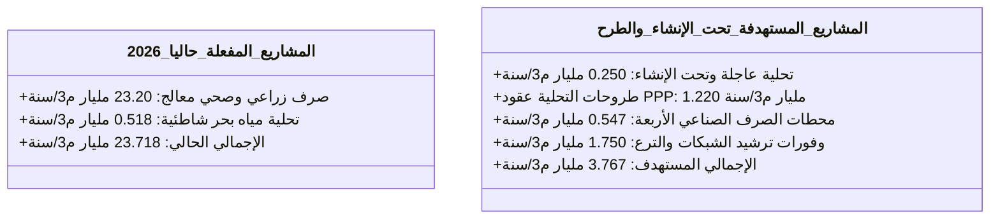

# 🌊 السجل الشامل للمشروعات المائية غير التقليدية وحصر طاقات التدوير والتحلية 🚀

يستهدف هذا المستند تجميع الحصر المالي والفني الشامل لكافة المشروعات المائية العملاقة في جمهورية مصر العربية لعام 2026، مقسمة بدقة بين المنظومات المفعلة رسمياً والمشروعات المستهدفة جاري طرحها وإنشائها بحلول عام 2050، مدعومة بخطط الطوارئ التشغيلية والميزانيات المرصودة لحماية الأمن المائي القومي.

---

## 📜 حقوق الابتكار والملكية الفكرية

* **المهندس والمبتكر الرئيسي:** أوسان عادل عبدالباري أحمد سلطان (AWSAN ADEL ABDULBARI AHMED SULTAN)
* **رقم الهوية الوطنية / الجواز:** 01010305468 (الجمهورية اليمنية - YEMEN)
* **الكيان الاعتباري المطور:** أوسان دو لخدمات التسويق (AWSAN DEW FOR MARKETING SERVICES)
* **رقم الهاتف للتواصل:** 00967777852433

---

## 🟢 أولاً: المشاريع المفعّلة والمستغلة حالياً (2026)

تنتج هذه المشروعات حالياً إجمالي **23.718 مليار متر مكعب سنوياً** من المياه البديلة لتأمين احتياجات قطاعي الزراعة ومياه الشرب بالمدن الجديدة:

### 1. معالجة وتدوير مياه الصرف الزراعي والصحي (23.2 مليار متر مكعب/سنوياً)
تُعد الركيزة الأساسية لمنظومة إدارة العجز المائي القومي، وتضم المحطات العملاقة التالية:
* **محطة الدلتا الجديدة (الحمام):** الأكبر عالمياً؛ تعمل بطاقة **7.5 مليون متر مكعب يومياً** (قرابة 2.73 مليار م³ سنوياً) لتغذية أراضي مشروع الدلتا الجديدة ومستقبل مصر.
* **محطة بحر البقر:** تعمل بطاقة **5.6 مليون متر مكعب يومياً** (نحو 2.04 مليار م³ سنوياً) لخدمة زراعة أراضي شمال ووسط شبه جزيرة سيناء.
* **محطة المحسمة:** تعمل بطاقة **1 مليون متر مكعب يومياً** (نحو 365 مليون م³ سنوياً) لإعادة تدوير مياه الصرف شرق قناة السويس.
* **محطات الصرف الصحي والبلدي المطورة:** (مثل توسعات محطات الجبل الأصفر وأبو رواش)؛ تساهم بمعالجة ثلاثية متطورة لباقي الإيراد لإعادة الاستخدام الآمن في الري المقيد والمسطحات الخضراء.

### 2. محطات تحلية مياه البحر الحالية (1.31 مليون متر مكعب/يومياً)
* **حجم الإنتاج السنوي الفعلي:** حوالي **518 مليون متر مكعب سنوياً** (ما يعادل 1.42 مليون م³ يومياً كطاقة إنتاجية مرنة وموزعة).
* **المشروعات القائمة:** تشمل 129 محطة تحلية مفعلة بالكامل تنتشر في محافظات مطروح، البحر الأحمر، جنوب سيناء، وشمال سيناء (مثل محطة تحلية العريش العملاقة، محطات الجلالة، ومحطات العلمين الجديدة) لتغطية مياه الشرب لمدن الجيل الرابع الساحلية.

---

## 🔵 ثانياً: المشاريع المستهدفة والتي سيتم تنفيذها (تحت الطرح والإنشاء)

تستهدف الخطط التوسعية إضافة **6.81 مليار متر مكعب سنوياً** بحلول عام 2050 عبر جذب استثمارات القطاع الخاص بنظام الشراكة (PPP):

### 1. الخطط التوسعية لتحلية مياه البحر (المرحلة العاجلة والبعيدة)
* **محطات التحلية تحت الإنشاء حالياً:** حزمة تشمل 19 محطة جديدة أوشكت على دخول الخدمة بطاقة إضافية تبلغ **687 ألف متر مكعب يومياً** (نحو 250 مليون م³ سنوياً).
* **المرحلة الأولى لطروحات التحلية (عقود الـ PPP):** طرح 21 محطة تحلية جديدة بالتعاون مع صندوق مصر السيادي بطاقة إجمالية تبلغ **3.35 مليون متر مكعب يومياً** (نحو 1.22 مليار م³ سنوياً)، وتضم محطة عملاقة بالمنطقة الاقتصادية لقناة السويس بطاقة 500 ألف م³ يومياً.
* **الخطة الاستراتيجية طويلة الأمد لعام 2050:** تستهدف رفع سعة تحلية المياه الساحلية الكلية لتصل إلى **10 ملايين متر مكعب يومياً** (نحو 3.65 مليار متر مكعب سنوياً).

### 2. مشروعات معالجة مياه الصرف الصناعي المركزية
* **الآلية:** إنشاء **4 محطات مركزية كبرى متطورة** لمعالجة الصرف الصناعي وإعادة تدويره في الأنشطة الصناعية المغلقة ومصانع البتروكيماويات (في العامرية بالإسكندرية وأبو رواش بالجيزة) بطاقة تبلغ **1.5 مليون متر مكعب يومياً** (نحو 547 مليون م³ سنوياً).

### 3. وحدات صفر رجيع ملحي (ZLD) الملحقة بالتحلية
* **الآلية:** دمج وحدات استخلاص المعادن والتعدين المائي التي ابتكرها المهندس أوسان عادل كاشتراط إلزامي استثماري في محطات التحلية الـ 21 الجديدة لحماية بيئة البحر المتوسط وتحقيق عوائد سنوية تتجاوز **22 مليون دولار** لكل محطة من مبيعات الملح الصناعي والمغنيسيوم.

### 4. مشروعات ترشيد الفاقد وإحلال الشبكات
* **الآلية:** استكمال المشروع القومي لتبطين الترع وتحويل قنوات النقل المفتوحة لأنابيب مغلقة، والتحول الإجباري للري الحديث، مما يضمن توفير وضخ **1.75 مليار متر مكعب سنوياً** من المياه المهدرة حالياً بالبخر والتسرب الباطني.

---

## 📊 ثالثاً: ملخص الميزان المائي السنوي وحجم الإنتاج الكلي

### 📋 مصفوفة حصر كميات المياه السنوية (مليار متر مكعب / سنوياً):

| تصنيف ونوع المشروعات المائية غير التقليدية | كمية المياه الحالية (مفعلة 2026) | كمية المياه المستهدفة (سيتم تنفيذها) |
| :--- | :---: | :---: |
| **مشروعات إعادة تدوير الصرف (زراعي / صحي)** | 23.200 مليار م³ | خطط صيانة وتطوير كفاءة |
| **مشروعات تحلية مياه البحر الساحلية** | 0.518 مليار م³ | 1.470 مليار م³ |
| **محطات معالجة الصرف الصناعي المغلقة** | وحدات داخلية محدودة | 0.547 مليار م³ |
| **وفورات ترشيد الشبكات وإحلال قنوات النقل** | مشاريع جارية | 1.750 مليار م³ |
| **إجمالي الإيراد المائي البديل السنوي** | **23.718 مليار متر مكعب** | **3.767 مليار متر مكعب** |

---

## 🔮 رابعاً: الرؤية التوسعية والخطط المستقبلية لآفاق 2050

* **توطين صناعة الأغشية الفائقة (Membranes):** التوسع في إنشاء مصانع وطنية بمصر لإنتاج أغشية التناضح العكسي وأغشية الفلترة النانوية محلياً بشراكات عالمية، لخفص التكلفة الرأسمالية (CAPEX) للمحطات المستقبلية بنسبة 30% ومنع خروج الدولار.
* **الربط الهيدروليكي الذكي للمحطات الساحلية:** ربط كافة محطات التحلية المستقبلية الـ 21 بشبكة توزيع دائرية موحدة تغذي ظهير الساحل الشمالي بالكامل ومجرى "النهر الصناعي الدوار"، لضمان مرونة نقل المياه بين المحافظات الساحلية في أوقات الذروة السياحية أو الزراعية.

---

## ⚠️ خامساً: خطة الطوارئ والمحاور التشغيلية لحماية مشاريع التدوير والتحلية

لحماية استقرار تدفق الـ 27.48 مليار متر مكعب الإجمالية (الحالية والمستقبلية) ومنع حدوث أي قفزات مفاجئة في تكاليف التشغيل، تم وضع المحاور التالية:

### المحور 1: حدوث تلوث حاد مفاجئ (بقع زيت أو تلوث كيميائي) أمام مآخذ محطات التحلية الساحلية
* **الخطر:** انسداد وتلف كامل لأغشية التناضح العكسي (RO) الحساسة في محطات العلمين أو قناة السويس، وتوقف ضخ مياه الشرب للمدن الساحلية.
* **إجراءات الطوارئ:** التفعيل الفوري لـ "حواجز المطاط العائمة الطارئة" لمحاصرة التلوث؛ تحويل مأخذ المحطة المتضررة آلياً إلى "آبار الشاطئ الجوفية المالحة التبادلية" (Beach Wells) كبديل نقي ومحمي طبيعياً؛ وتشغيل الفلترة الفائقة بالفحم المنشط المستخرج من مشروع الحشائش لحماية الأغشية وضمان استمرار الضخ بنسبة 100%.

### المحور 2: ارتفاع أحمال التلوث العضوي (COD/BOD) بمحطات الصرف الزراعي الكبرى
* **الخطر:** زيادة تدفقات الملوثات في مصرف بحر البقر أو الحمام بما يتجاوز السعة التصميمية للمرشحات الثلاثية، مما يهدد بوقف المحطة وخسارة ملايين الأمتار المكعبة لزراعات سيناء والدلتا الجديدة.
* **إجراءات الطوارئ:** حقن مجرى المصارف مسبقاً بـ "جرعات أكسجين مكثفة وميكروبات معالجة بيولوجية هوائية طارئة" (Bio-augmentation) لتسريع الأكسدة قبل وصول المياه للمحطة بـ 5 كم، مع تقليص سرعة التدفق الهيدروليكي بنسبة 15% وزيادة فترات الغسيل العكسي الآلي للفلاتر الرملية لضمان خروج مياه ري مطابقة للمواصفات القياسية.
* **الميزانية المرصودة لطوارئ الأصول والتدوير:** **9.5 مليون دولار أمريكي** (تُحتجز احتياطياً نقدياً ائتمانياً ثابتاً في حساب الطوارئ السيادي للمشروع لتمويل الشراء الفوري لقطع الغيار الحرج، كبسولات البكتيريا النشطة، وشحنات الأغشية الاحتياطية سريعة الشحن).

---
*تم حصر المشروعات وجدولتها هيكلياً تحت إشراف وتصميم المهندس أوسان عادل عبدالباري أحمد سلطان © 2026.*
